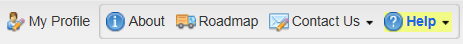
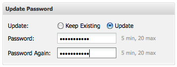
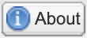
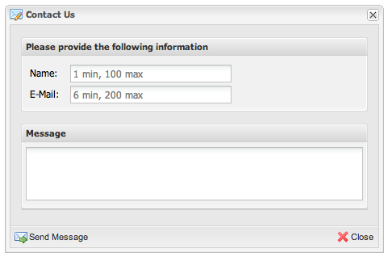
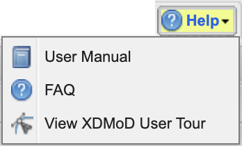
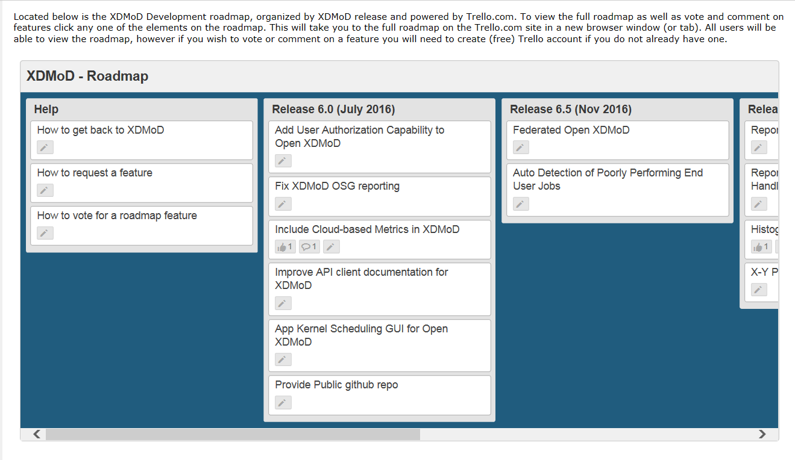
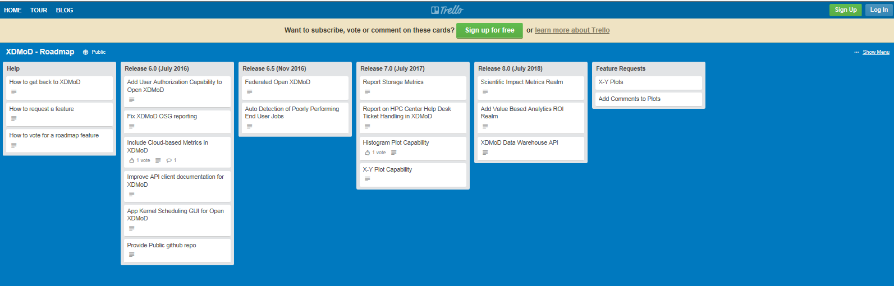
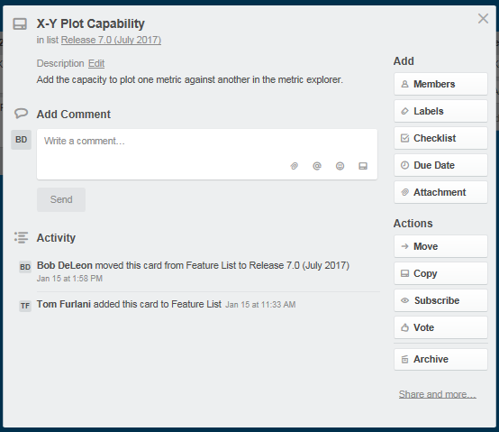

My Profile, About, Roadmap, Contact and Help
===============================================

On the upper right side of the XDMoD page, there are a series of five
buttons that allow the user to set his profile, get more information
about XDMoD, view the XDMoD Roadmap, contact the XDMoD developers and
seek help.

   My Profile, About, Roadmap, Contact and Help functional button

.. _my_profile_button:

My Profile Button
----------------------

My profile allows you to view and update general settings pertaining to
your account. To access your profile, click on the **My Profile** button
located in the upper right section of the portal.

Your current role will be displayed in the title bar of the **My
Profile** window. In the figure above, for example, it shows the user is
a **Program Officer**.

The first section in the **My Profile** window contains **User
Information** such as: First Name, Last Name, and Email Address. All of
the aforementioned fields must be specified in order to update your
profile.

The last section in **My Profile** allows you to optionally update your
account password. In order to update your password, click the **Update**
radio button and specify the new password twice into the fields that
follow.

   Password change window

.. only:: Open

   Also in the **My Profile** window is the option to choose your **Role
   Delegation** by clicking the tab at the top of the window (:numref:`my_profile_role_delegation_menu`).
   This tab allows you to choose a specific staff member
   connected to your account to delegate special privileges.

   .. figure:: media/image112.png
      :name: my_profile_role_delegation_menu

      Role Delegation Menu

About Button
-----------------

   About Button

Clicking the about button will display a page of information about
XDMoD.

Contact Button
-------------------

   Contact Us Button

Selecting the contact button will bring up a window that allows the user
to send a message to the XDMoD team. The user must fill in his name,
email address and his message.

   Contact window

Help Menu
--------------

   Help menu

Clicking on the Help menu will provide you with the following options:
User Manual, FAQ, and View XDMoD User Tour (:numref:`about_help_menu`). Clicking on User
Manual will direct the user to the XDMoD User Manual (the document you
are viewing at this very moment). If help is available for the section
of XDMoD you are currently visiting, the User Manual will automatically
navigate to the respective section when it loads. Clicking on FAQ will
take you to a page containing Frequently Asked Questions. Clicking on
View XDMoD User Tour will bring you to the user tour of common UI elements.
Go to our `YouTube Channel <https://www.youtube.com/channel/UChm_AbEcBryCdIfebN5Kkrg>`_
to find more help on navigating the XDMoD interface.

Roadmap
------------

Clicking on the RoadMap button brings up a screen which displays an
information page giving details on how to navigate to the XDMoD
development roadmap (:numref:`about_roadmap_info`). Click on any feature in this page
and you will be taken off of the XDMoD site to the Trello.com site where
you will be able to view and interact with the XDMoD roadmap (:numref:`about_trello_roadmap`).
To return to XDMoD, simply close the browser tab/window. If you
simply want to view the Roadmap you can select the various Trello cards
shown in :numref:`about_trello_roadmap` for further details about each roadmap task.
You can also “vote” for a feature in the roadmap that you would
particularly like to use. To do this Sign Up or Log In to Trello (upper
right corner Figure 15-6). Then clicking on any roadmap feature such as
X-Y plot capacity, will give you access to the Vote box, as shown in
:numref:`about_roadmap_voting`.

   Roadmap information page

   XDMD Roadmap on Trello.com

   Voting for a feature in the XDMD Roadmap on Trello.com
