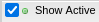
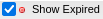

.. _allocations_tab:

Allocations Tab
=================

The Allocations Tab displays information about both active and
expired allocations. Toggle the |active| button or the |expired|
button to view only allocations that are active or expired.
The default view shows a summary for the logged-in individual.
Use the search feature shown in (:numref:`search`) to look up
allocations for other individuals.

   View a summary of your allocations.

The summary view provides basic information about each allocation
including title, charge number, project timeframe, and SU balance.
Allocation information in ACCESS XDMoD is updated daily and therefore does
not have information from the current day. For the most up-to-date information
about an allocation, log in to the `ACCESS Allocations`_ page.

.. _ACCESS Allocations: https://allocations.access-ci.org/

   Look up other ACCESS allocations using the search feature.

Click the '+' icon next to an allocation to view additional information
including associated users and associated resources.

   View additional information about an allocation.

The usage for an individual on an allocation can be broken down by
resource.

   Break down usage by resource.
