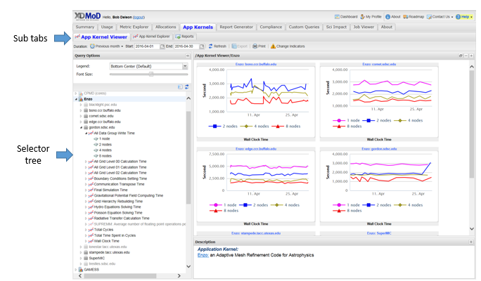
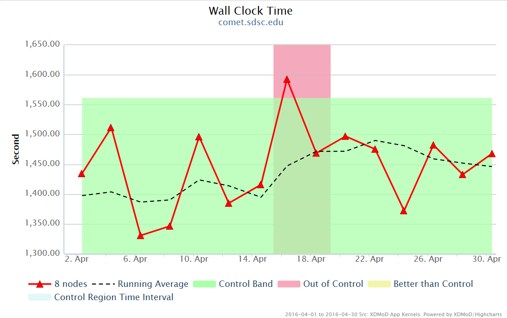
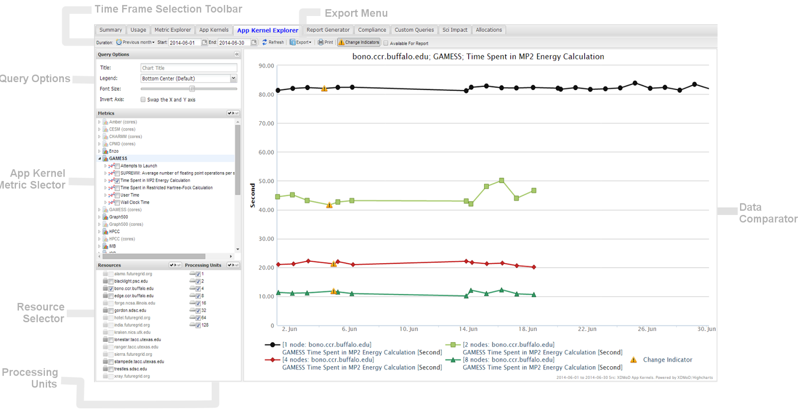
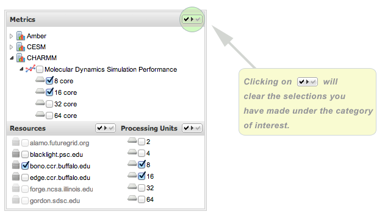
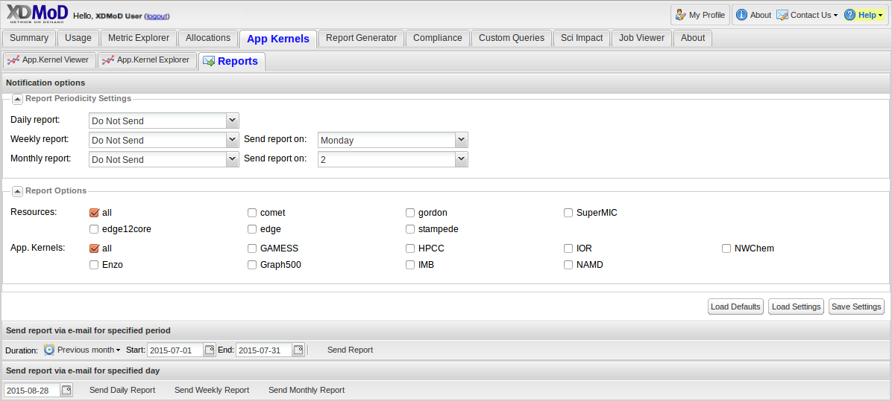

.. _app_kernals:

App Kernels
==============

   Application Kernels

The Application Kernels Tab consists of three subsections, each has a
specific goal in order to make viewing Application Kernels simple and
intuitive. The three sections consist of the **Application Kernels
Viewer**, **Application Kernels Explorer** and the **Reports**
subsidiary tabs. The section below will describe each of these
subsidiary tabs in much greater detail

App Kernels Viewer
-----------------------

The Application Kernel Viewer selector tree (:numref:`app_kernels`) functions
similarly to the chart selection tree of the Usage tab. Data is
displayed hierarchically where the top level nodes are the names of the
available application kernels followed by the resources on which that
kernel was run, followed by the metrics that were generated on that
resource, followed by the number of processing units used as shown in
:numref:`app_kernels`. Clicking on the tree nodes will display a set of
thumbnails in the chart viewer that reflects the node's location in the
hierarchy - the farther down in the hierarchy that a node lies, the more
specific the set of data displayed. The available node types are:

-  App Kernel: |image30| Selecting an application kernel name will load
      all thumbnails associated with that kernel (all metrics for all
      resources).

-  Resource: |image31| Selecting a resource loads the thumbnails for all
      the metrics collected for this resource and application kernel.

-  Metric |image32|: Selecting a metric will display the chart with a
      dataset for each number of processing units.

-  Processing Unit: |image33| Selecting the number of processing units
      will display data for the specific number of processing units for
      that metric, resource, and application kernel.

When navigating the App Kernels Viewer subtab, targeting solely a
specific number of node configuration will yield a comprehensive plot:

   Application Kernel Viewer Plot

The following table helps to analyze the plot more effectively:

+--------------+-------------------------------------------------------+
| **Change     | An exclamation point icon is shown if and whenever a  |
| Indicators** | change occurs to the execution environment of the app |
|              | kernel (library version, compiler version, etc).      |
+==============+=======================================================+
| **Running    | Shown as a dashed line on the chart. The running      |
| Average**    | average is the linear average of the last five        |
|              | values.                                               |
+--------------+-------------------------------------------------------+
| **Control    | A green band is shown, representing the values of the |
| Band**       | running average considered "In Control" at any given  |
|              | time. A control region is picked to be the first few  |
|              | points in a data set and updated whenever an          |
|              | execution environment change is detected by the app   |
|              | kernel system. The control band then is calculated by |
|              | clustering the control region into two sets based on  |
|              | the median and then finding the average of each set.  |
|              | The two averages define the control band.             |
+--------------+-------------------------------------------------------+
| **Control    | A red interval is shown on the plot when the control  |
| Zones**      | value falls below **-0.5**, indicating an out of      |
|              | control (worse than expected) running average, and a  |
|              | yellow interval when the control value is greater     |
|              | than **0,** indicating a better than control (better  |
|              | than expected) running average. Other running average |
|              | values are considered "In Control".                   |
+--------------+-------------------------------------------------------+
| **Control    | Represented as a dotted line. The control is          |
| Plot**       | calculated as the distance of the running average to  |
|              | the nearest boundary of the control band, normalized  |
|              | over the range of the control band.                   |
+--------------+-------------------------------------------------------+
| **Discrete   | Convert the control values from real numbers to       |
| Controls**   | discrete values of **-1**, **0**, **1**. Values less  |
|              | than zero become **-1** and values greater than zero  |
|              | become **1**.                                         |
+--------------+-------------------------------------------------------+

App Kernel Explorer
------------------------

   App Kernel Explorer

The App Kernel Explorer (:numref:`app_kernel_explorer`) allows you to conveniently
compare performance between two or more resources, provided the
selection of processing units and metrics. Any changes in selections
made on the left-hand section of the Data Explorer will immediately be
reflected in the right-hand section (**Data Comparator**).

It is important to note that changes made in the **Metrics** Section
affect the availability of options in the Resource Selector.

Selections made in the **Processing Units** section are considered
*global* in the sense that they are applied to every single metric
selected. Any selections (and de-selections) made in **Processing
Units** override those made for any metric. Processing units can be
selected by clicking the check boxes.

Alternatively, all possible values for either Metrics, Resources or
Processing Units can be toggled on or off using the global selection
boxes as shown in :numref:`app_kernel_explorer_reset`.

   Reset buttons for App Kernel Explorer sections

Reports tab
----------------

The Reports tab (:numref:`app_kernel_reports_subtab`) is used for sending reports based on a
specific Resource and App Kernel. The first section of the Reports tab
is for sending reports periodically. The options include daily report,
weekly report and monthly report. Each of these time frames contains a
pull down menu which gives a set of options indicating under what
circumstances a report will be sent. The options include always, on any
error, on any major error, on pattern errors or on major pattern errors.

The weekly report and monthly report also have another drop down menu
which gives options for day of the week for weekly report (e.g. Monday,
Tuesday, etc.) and which day of the month for monthly report (e.g 1st,
2nd, 3rd, etc.). Once all settings have been selected, you can click
save settings in order to start sending reports.

There is also an option to send reports covering specific and
customizable date ranges via email; this can be found directly below the
first section.

   Reports Subtab
