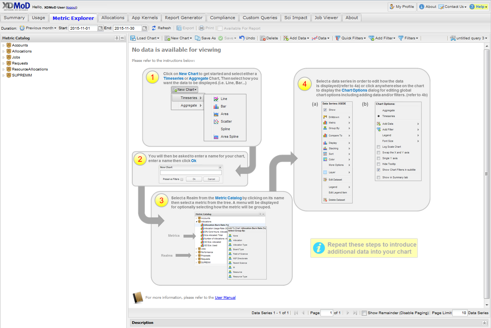

Browser Requirements
======================

XDMoD supports all major desktop web browsers (with JavaScript enabled)
including:

| • Google Chrome 61+
| • Microsoft Edge 16+
| • Firefox 52+
| • Safari 9+

**User’s Guide:** Substantial work has gone into making the XDMoD user
interface easy to use. However, given its powerful analytical
capabilities, it can nonetheless be challenging for users to fully
exploit its capability. To help remedy this, a User’s Guide and FAQ,
available through the *Help Button* on the top right hand side of the
XDMoD Portal window have been developed. The user guide provides
detailed instructions for utilizing all aspects of XDMoD from obtaining
an account to explaining common user interface elements and getting the
most out of powerful tools such as the Metric Explorer. Access to the
guide is context sensitive providing direct access to the most relevant
portions of the guide based on what the user was viewing when they
requested the help. For example, if one accesses the user guide while
viewing the Metric Explorer tab they will be brought directly to the
section of the manual describing that tab. In addition to the user
manual, a “quick start” guide is provided directly within XDMoD for
several tools including the Metric Explorer, Application Kernel
Explorer, Report Generator and Job Viewer tab. As shown in :numref:`xdmodquickstart`,
when a user views the Metric Explorer tab and has not created a
query, visual assistance is provided to guide them in quickly getting
started.

    XDMoD Help. *The XDMoD Quick Start Guide for the
    Metric Explorer Tab*
