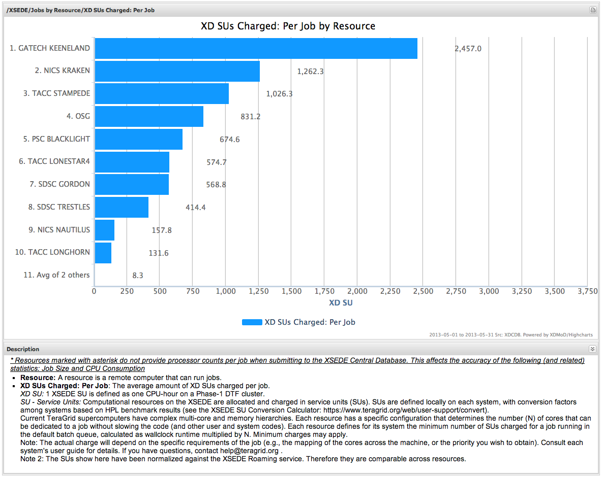

.. _common_user_interface_elements:

Common User Interface Elements
================================

Here we describe some common XDMoD user interface elements.

.. _duration_selection_toolbar:

Duration Selection Toolbar
------------------------------

.. figure:: media/image133.png
   :name: durationtoolbar

   Duration Selection Toolbar

The duration selection toolbar (:numref:`durationtoolbar`) is used for selecting
the range of data displayed in a particular data set or chart. It
consists of a drop down list containing commonly accessed time frames,
as well as a pair of date choosers for configuring the user defined time
frames start and end dates, followed by a refresh button for reloading
the data and in turn refreshing the screen.

.. table::
   :widths: 50 50

   +-----------------------------------+----------------------------------+
   | .. figure:: media/image115.png    | When you interact with the       |
   |    :name: start_end_toolbar       | **Start** and **End** date       |
   |                                   | fields, the **Refresh** button   |
   |    Start and end toolbar          | will automatically highlight to  |
   |                                   | indicate that it needs to be     |
   |                                   | pressed to apply the new         |
   |                                   | timeframe. Pressing ENTER in     |
   |                                   | either the Start or End date     |
   |                                   | field will accomplish the same   |
   |                                   | thing.                           |
   +-----------------------------------+----------------------------------+

.. table::
   :widths: 50 50

   +-----------------------------------+------------------------------------------+
   | .. figure:: media/image106.png    | The user can choose from a series of     |
   |    :name: common_preset_time      | commonly selected time frames including  |
   |                                   | 7, 30, and 90 days from the present or   |
   |    |image5| Preset time frames    | 1, 2, 3, 5, and 10 years from the        |
   |    menu                           | present or a number of calendar years.   |
   |                                   | Alternatively, a user can select their   |
   |                                   | own custom date range for which to       |
   |                                   | display data.                            |
   |                                   |                                          |
   |                                   | The Aggregation Unit selector is located |
   |                                   | at the bottom of the Duration preset     |
   |                                   | menu. The aggregation unit determines    |
   |                                   | the bin granularity for the time series  |
   |                                   | data. XDMoD automatically chooses a      |
   |                                   | default value dependent on the date      |
   |                                   | range selected. However, the user can    |
   |                                   | override this default value using the    |
   |                                   | aggregation unit selector. Note that for |
   |                                   | very long time date durations, greater   |
   |                                   | than 2 years, the day aggregation level  |
   |                                   | is not supported.                        |
   +-----------------------------------+------------------------------------------+

.. table::
   :widths: 30 70

   +---------------------------------+---------------------------------------------------+
   | .. figure:: media/image8.png    | The user may choose to click on the |image8|      |
   |    :name: custom_time_frames    | button, located to the right of the start and end |
   |                                 | date choosers, to get the interactive date        |
   |    |image7| Custom time         | chooser, shown on the left, for selecting a date  |
   |    frames - interactive data    | value interactively via the mouse, keyboard and   |
   |    chooser                      | touch input. In order for the date from the       |
   |                                 | interactive date chooser to become the effective  |
   |                                 | selected date of the date chooser, the user must  |
   |                                 | click a day in the calendar or click the          |
   |                                 | \`Today\` button. This will hide the interactive  |
   |                                 | date chooser and replace the value in the         |
   |                                 | corresponding date chooser. If the interactive    |
   |                                 | date chooser goes away due to the user clicking   |
   |                                 | another part of the screen, the value of the date |
   |                                 | chooser will not change.                          |
   +---------------------------------+---------------------------------------------------+

.. |image7| image:: media/image1.png

.. |image8| image:: media/image1.png

Chart Configuration Toolbar
-------------------------------

.. figure:: media/image53.png
   :name: chart_config_toolbar

   Chart Configuration Toolbar

The chart configuration toolbar (:numref:`chart_config_toolbar`) provides options for a
user to customize the appearance of individual charts (and their
datasheet view), export the data in a number of output formats, and make
a chart available to the :ref:`Report Generator <report_generator>`

   Dataset Filter

When the user clicks on the filter button, the chart configuration
toolbar is presented with a multi-selector that provides a list of
available data sets to the left and a set of selected data sets to the
right, for example, :numref:`dataset_filter` which displays the filter by resource
multi-selector. The user can then select the desired filter choices by
clicking on the check boxes. The search box and the paging mechanisms
shown in :numref:`dataset_filter` are available to assist the user in sorting
through filters having large numbers of choices. Note that for the Usage
tab that the user must drill down first before the filter becomes
active. The manual sections on the Usage tab and the Metric Explorer
give more details on the use of the filters.

.. table::
   :widths: 30 70

   +----------------------------------+---------------------------------------------------+
   | .. figure:: media/image18.png    | When the user clicks on the Display button in the |
   |    :name: common_display_menu    | Usage tab, they are presented with a menu for     |
   |                                  | customizing the display of the current chart or   |
   |    |image10| Display menu.       | data. Options include:                            |
   |                                  |                                                   |
   |                                  | -  Timeseries: When this option is selected, it   |
   |                                  |       causes the underlying data to use time as   |
   |                                  |       an additional dimension to group the        |
   |                                  |       results. Otherwise, the values shown on the |
   |                                  |       chart will be the overall value for the     |
   |                                  |       chosen statistic over the entire selected   |
   |                                  |       duration.                                   |
   |                                  |                                                   |
   |                                  | -  Legend: A legend will be included in the chart |
   |                                  |       image containing detailed information about |
   |                                  |       each data point. Note: this is only         |
   |                                  |       available in Timeseries or Pie chart mode.  |
   |                                  |                                                   |
   |                                  | -  Log Scale: When selected, the chart will use   |
   |                                  |       log scale for its main data axis.           |
   |                                  |                                                   |
   |                                  | -  Datasheet: The view is changed to a            |
   |                                  |       spreadsheet showing the underlying data of  |
   |                                  |       the chart.                                  |
   |                                  |                                                   |
   |                                  | -  Charts - The various types of charts include:  |
   |                                  |                                                   |
   |                                  |    -  Bar - Vertical: The chart generated will be |
   |                                  |          displayed as a series of bars with each  |
   |                                  |          data point represented by a vertical     |
   |                                  |          bar. All bars will be the same color.    |
   |                                  |                                                   |
   |                                  |    -  Bar - Horizontal: The chart image generated |
   |                                  |          will be a bar chart with each data point |
   |                                  |          represented by a uniquely colored        |
   |                                  |          horizontal bar. This option is not       |
   |                                  |          available for timeseries data.           |
   |                                  |                                                   |
   |                                  |    -  Line: Displays each data series as a line.  |
   |                                  |                                                   |
   |                                  |    -  Area: Displays each data series as a filled |
   |                                  |          area each of which has a unique color.   |
   |                                  |                                                   |
   |                                  |    -  Pie: Displays the data as a pie chart where |
   |                                  |          each data point has a unique color. This |
   |                                  |          option is not available for timeseries   |
   |                                  |          data.                                    |
   |                                  |                                                   |
   |                                  | -  Combine Modes - How multiple data series will  |
   |                                  |       be aligned next to each other in the chart  |
   |                                  |       (applies only to timeseries charts where    |
   |                                  |       multiple data series are represented) .     |
   |                                  |                                                   |
   |                                  |    -  Side - Position the bars or areas           |
   |                                  |          representing different data series next  |
   |                                  |          to each other.                           |
   |                                  |                                                   |
   |                                  |    -  Stack - Different data series will be       |
   |                                  |          stacked on top of each other.            |
   |                                  |                                                   |
   |                                  |    -  Percentage - Different data series will be  |
   |                                  |          stacked on top of each other and occupy  |
   |                                  |          the whole range of the y-axis to         |
   |                                  |          indicate the percentage of total that    |
   |                                  |          each data series represents.             |
   |                                  |                                                   |
   |                                  | -  Reset - Restores the settings for the chart to |
   |                                  |       its default configuration.                  |
   |                                  |                                                   |
   |                                  | -  Persist - The settings applied through the     |
   |                                  |       Display menu will persist across any other  |
   |                                  |       charts you view.                            |
   |                                  |                                                   |
   +----------------------------------+---------------------------------------------------+

.. |image10| image:: media/image12.png

.. table::
   :widths: 50 50

   +----------------------------------+---------------------------------------+
   | .. figure:: media/image33.png    | Allows the user to download a chart   |
   |    :name: common_export_menu     | image in a number of formats or to    |
   |                                  | export the underlying data. When the  |
   |    |image11| Export menu         | user presses the Export button they   |
   |                                  | will be presented with a list of      |
   |                                  | possible export formats, which        |
   |                                  | include:                              |
   |                                  |                                       |
   |                                  | -  CSV - Comma Separated Values:      |
   |                                  |       Export the raw data in CSV      |
   |                                  |       format.                         |
   |                                  |                                       |
   |                                  | -  XML - Export the raw data in XML   |
   |                                  |       format (Appendix I)             |
   |                                  |                                       |
   |                                  | -  PNG - Portable Network Graphics:   |
   |                                  |       Export the chart as a PNG file. |
   |                                  |                                       |
   |                                  | -  SVG - Scalable Vector Graphics:    |
   |                                  |       Export the chart as a           |
   |                                  |       lightweight vector file         |
   |                                  |       suitable for printing.          |
   |                                  |                                       |
   |                                  |                                       |
   |                                  | -  PDF - Portable Document Format:    |
   |                                  |       Export the chart as a PDF file  |
   |                                  |       suitable for embedding in a     |
   |                                  |       Word or LaTeX document.         |
   |                                  |                                       |
   |                                  | The image export options in the       |
   |                                  | **Export menu** provide the ability   |
   |                                  | to choose the size of the file, the   |
   |                                  | font size and whether to display the  |
   |                                  | chart title in the exported image.    |
   |                                  | The PNG and SVG options have settings |
   |                                  | for small, medium, large and poster   |
   |                                  | size images and a ‘Custom’ setting    |
   |                                  | that allows fine grained control over |
   |                                  | the image size in pixels. The PDF     |
   |                                  | option allows the user to specify the |
   |                                  | width and height of the PDF in inches |
   |                                  | and the font size in points.          |
   +----------------------------------+---------------------------------------+

.. table::
   :widths: 50 50

   +-----------------------------------+----------------------------------------------------+
   | .. figure:: media/image108.png    | Selecting the Available for Report check box will  |
   |    :name: common_available_report | cause the chart to be added to the list of         |
   |                                   | available charts for the Report Generator.         |
   |    "Available For Report" check   |                                                    |
   |    box.                           | Note that the chart will retain the duration and   |
   |                                   | display customizations made prior to checking the  |
   |                                   | box.                                               |
   +-----------------------------------+----------------------------------------------------+

Chart Selection Tree
------------------------

.. table::
   :widths: 50 50

   +----------------------------------+----------------------------------------+
   | .. figure:: media/image14.png    | The chart selection tree is displayed  |
   |    :name: chart_selection_tree   | in the Usage Tab. The tree nodes are   |
   |                                  | grouped by Realm (e.g., Jobs,          |
   |    Chart Selection Tree.         | Allocations, SUPReMM, etc.) and there  |
   |                                  | are three levels of data (nodes).      |
   |                                  |                                        |
   |                                  |  1. Dimension: |image13| These are the |
   |                                  |     first level of nodes in the        |
   |                                  |     tree and are defined based on      |
   |                                  |     the inherent grouping of the       |
   |                                  |     data, e.g. by Resource, by         |
   |                                  |     Provider, etc.. When selected,     |
   |                                  |     the chart view will update and     |
   |                                  |     display the thumbnails or data     |
   |                                  |     sheets for all of the facts        |
   |                                  |     available for the selected         |
   |                                  |     dimension, e.g. Number of Jobs,    |
   |                                  |     Total SU charged, etc..            |
   |                                  |                                        |
   |                                  |  2. Fact: |image14| Fact nodes are     |
   |                                  |     children of the dimension nodes    |
   |                                  |     and when selected will load the    |
   |                                  |     chart or datasheet associated      |
   |                                  |     with the selected fact.            |
   |                                  |                                        |
   |                                  |  3. Drilldown: |image15| Drilldown     |
   |                                  |     nodes are children of fact         |
   |                                  |     nodes and are displayed when a     |
   |                                  |     user clicks on a chart data        |
   |                                  |     series (e.g., bar, line, or pie    |
   |                                  |     slice) to drill down to more       |
   |                                  |     detailed information about that    |
   |                                  |     series.                            |
   +----------------------------------+----------------------------------------+

.. |image14| image:: media/image67.png

Selection of a node in the tree can be accomplished by left-clicking the
node. A triangular icon to the left of the tree node will point to the
right when the node is collapsed and will point to the bottom right and
have a black fill when expanded. Double clicking a node will select and
expand it. Selected tree nodes are indicated by a light blue background.

Collapse All Button |image16|: This will collapse all of the expanded
nodes in the tree.

.. |image16| image:: media/image10.gif

Collapse Selector Tree Button |image17|: This will collapse the Usage
tab Chart Selection Tree to the left so that it is only visible as a
thin vertical bar to the left of the screen providing more screen area
for the display of the selected chart or data sheet. Clicking on the
button will show the Selector Tree again.

.. |image17| image:: media/image90.png

Chart Viewer
----------------

.. fig 10

   Chart Viewer

The chart viewer is shown in :numref:`chart_viewer` and provides an area where
the user can view and customize metric data as well as export the data
or make the chart available for inclusion in a custom report. At the top
of the Chart Viewer is a trail of breadcrumbs that shows the origin of
the chart. The chart shown in :numref:`chart_viewer` is from the
:only:`<XSEDE>ACCESS` view of the *Usage* tab. The *Jobs by
Resource* category is expanded, followed by selection of the *XD SUs
Charged: Per Job* metric.

Drilldowns: Most of the charts displayed in XDMoD have a drill-down
capability, which will allow users to click on a data series (bar, line,
pie slice, etc.) and acquire more detailed information about the
relevant selection. This is accomplished by hovering the mouse over a
particular data series in a chart and clicking on it, causing a new
drilldown node to be displayed in the Chart Selection Tree and the new
chart to be displayed. When drilldowns are available, the cursor will
change from an arrow to a hand. Whenever a drilldown is not possible the
user will be notified via a tooltip.

.. added captions to following two figures

.. figure:: media/image35.png
   :name: chart_drilldowns

   Example of when dilldown is available vs when drilldown is not available

For example, if the second horizontal bar in :numref:`drilldown_example` is clicked
on (NICS KRAKEN), followed by the selection of *Field of Science* from
the menu that appears, the chart shown in :numref:`drilldown_chart_example` will appear.
This new chart will take into account all fields of science which have
contributed to charging XD SUs to resource NICS KRAKEN (respective of
the timeframe selected). Note that the breadcrumb trail reflects the
origin of the chart.

.. figure:: media/image51.png
   :name: drilldown_example

   Example of adding a drilldown metric

.. figure:: media/image22.png
   :name: drilldown_chart_example

   Example of a drilldown chart

Every chart in XDMoD can zoom along a specific axis by click and dragging the cursor vertically or horizontally to zoom by the y-axis and x-axis, respectively.
When adjusting the zoom along a specific axis you will be able to adjust the range of the data based on how far you drag your cursor. Every chart in XDMoD can also
zoom along both the x and y axis adjusting the range for both. For most charts in XDMoD, the zoom level can be reset by double clicking on an empty area of the plot.
The only exception are charts in the Metric Explorer tab (see :ref:`Metric Explorer <metric_explorer>`).

.. figure:: media/plot_vertical_zoom.png
   :name: plot_vertical_zoom

   Example of adjusting the zoom along the y-axis (vertically).

.. figure:: media/plot_horizontal_zoom.png
   :name: plot_horizontal_zoom

   Example of adjusting the zoom along the x-axis (horizontally).

Chart Viewer Tools
~~~~~~~~~~~~~~~~~~~~~~~

.. figure:: media/image41.png
   :name: chart_viewer_tools

   Chart Viewer Tools (Thumbnail Views)

Located on the top right of the Usage tab chart viewer when a dimension
is selected, from left to right, this toolbar consists of the following
buttons:

-  Restoring the thumbnails to their original dimensions

-  Reducing the chart size

-  Increasing the chart size
