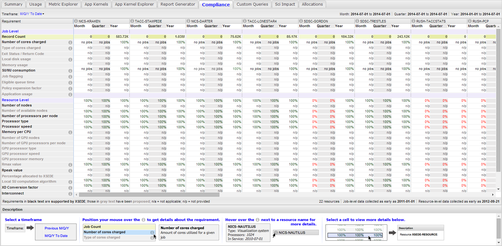
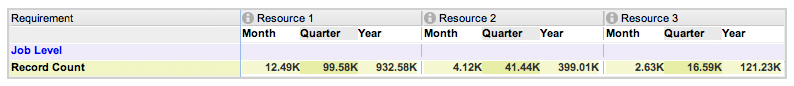
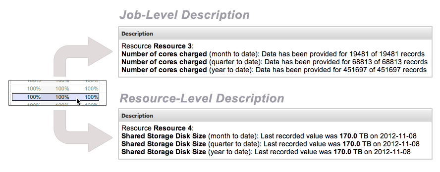
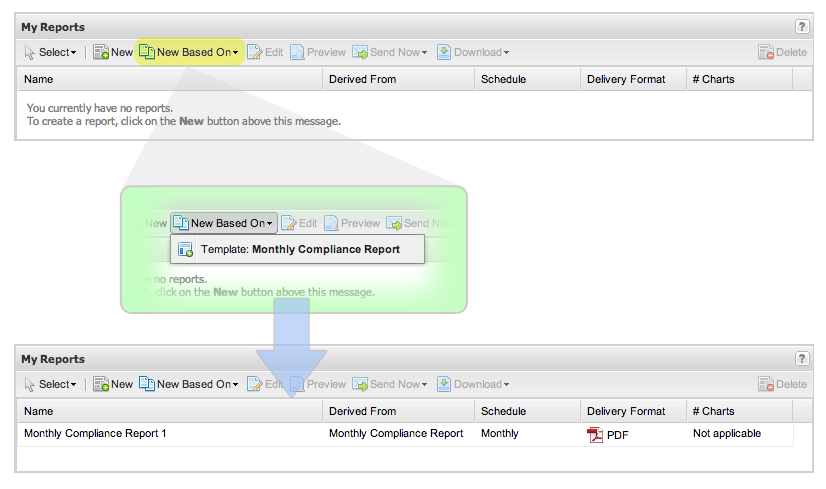

.. _compliance_tab:

Compliance Tab
=================

**Note:** The Compliance tab is currently available to program officers,
and will eventually be made available to center directors.

The Compliance tab allows one to quickly determine which service
providers are providing information with integrity. The Compliance tab
can be thought of as a “report card”, reflecting the level of
consistency in which each service provider is contributing information
relevant to ACCESS from a “job level” as well as “resource level”.

   Compliance tab

.. table::
   :widths: 40 60

   +-----------------------------------+---------------------------------------+
   | .. figure:: media/image126.png    | Under the Compliance tab,             |
   |    :name: compliance_requirements | requirements are displayed in the     |
   |                                   | left-most column.                     |
   |    Requirements Listing in the    |                                       |
   |    Compliance tab                 | Job-Level requirements                |
   |                                   | (:numref:`compliance_requirements` a) |
   |                                   | represent the attributes              |
   |                                   | which are to be supplied or           |
   |                                   | associated with each *job record*     |
   |                                   | that gets submitted to the ACCESS     |
   |                                   | allocation service.                   |
   |                                   |                                       |
   |                                   | Resource-Level requirements           |
   |                                   | (:numref:`compliance_requirements` b) |
   |                                   | are attributes which comprise the     |
   |                                   | technical specification of the        |
   |                                   | resource.                             |
   |                                   |                                       |
   |                                   | Requirements in **black text** are    |
   |                                   | supported by ACCESS. Requirements in  |
   |                                   | **gray text** are proposed by the TAS |
   |                                   | team. Due to this fact, any proposed  |
   |                                   | requirements will not currently be    |
   |                                   | provided on behalf of any resource    |
   |                                   | (hence **n/p** will be present in     |
   |                                   | respective cells of the grid).        |
   |                                   |                                       |
   |                                   | If more information is associated     |
   |                                   | with a given requirement it can be    |
   |                                   | found by hovering over the |image57|  |
   |                                   | icon to the right of its name.        |
   |                                   |                                       |
   |                                   | .. figure:: media/image4.png          |
   |                                   |    :width: 3.70833in                  |
   |                                   |    :height: 0.54167in                 |
   +-----------------------------------+---------------------------------------+

**Figure 14-2: Requirements Listing in the Compliance tab**

To determine compliance at a job-level, raw job records from the ACCESS
allocation service are analyzed on a daily basis. The first row
immediately under the **Job Level** header reflects this raw job record
count.

   Job Record count as determined from the XDcDB

For a given resource, raw (un-sanitized) job records pertaining to that
resource were collected via the ACCESS allocations service. Of those
collected records, it was determined that only a fraction (or subset) of
those records consisted of a meaningful value that represented the
number *of cores charged,* *SUs charged,* etc. This fraction is
represented as a percentage in the table cell where the *requirement*
row and the *resource* column intersect.

**Note:** It is important to note that a “job record” **does not**
correspond to a single job. Each resource’s definition of a “job”
varies.

To determine compliance at a resource-level, the Resource Description
Repository (RDR) is analyzed on a daily basis. If values pertaining to
requirements are present in the RDR for a given day, then the resource
is considered to be in compliance for that day. The percentage for
resource-level compliance takes into account the number of days (within
the given timeframe) the RDR was consulted, and of those consultations,
how many times values existed which represented resource specifications
such as *operating system*, *node count*, *processor type*, etc.

To view more details about a particular compliance value, simply click
on the cell of interest. As a result, the **Description** section at the
bottom will provide more information.

   Description associated with a cell in the Compliance grid

Note that the nature of the description changes, depending on whether
you click on a cell in the job-level or resource-level category.

Scheduled Compliance Reports
---------------------------------

Provided that you have the necessary privileges to view the Compliance
tab, you will also be able to set up periodic delivery of resource
compliance status through the :ref:`report_generator`
In the **My Reports** section of the Report Generator, click on the
**New Based On** button, then click on the template named **Monthly
Compliance Report**. As a result, a new report will be made available to
you, already configured for monthly delivery to the email address
associated with your XDMoD account.

   Creating a compliance report to be delivered on a monthly basis
