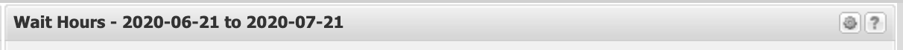
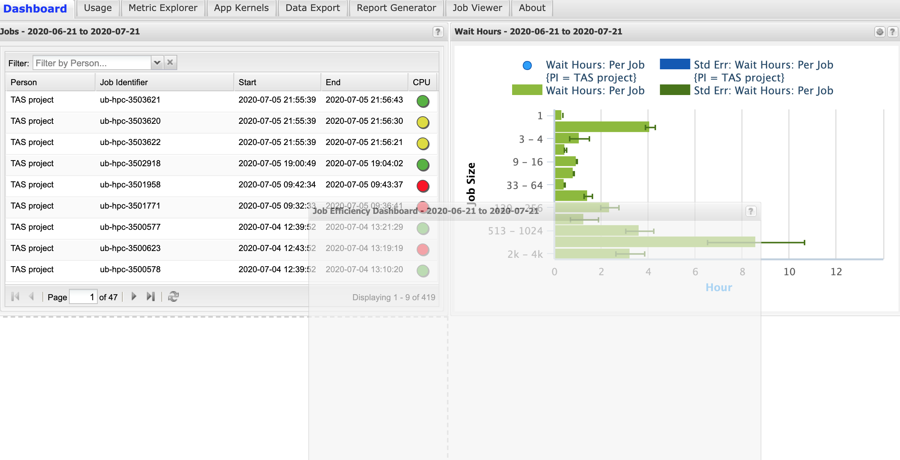
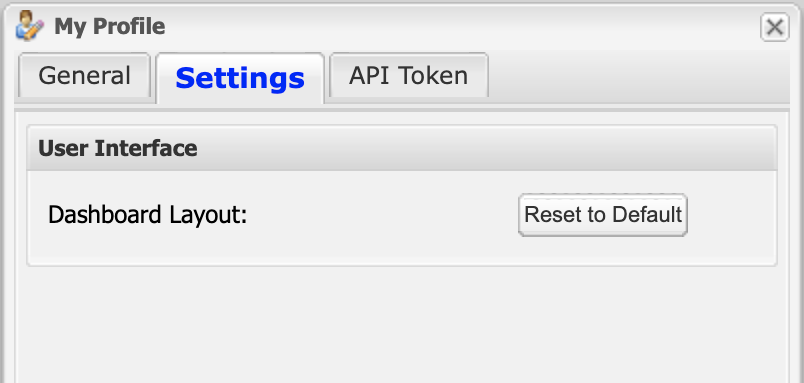
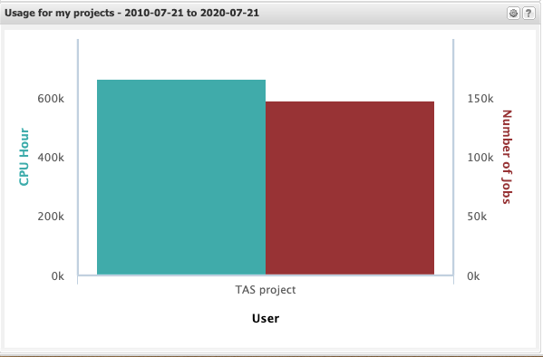
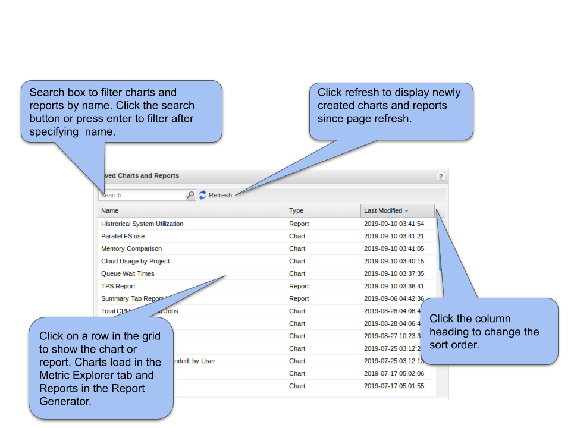
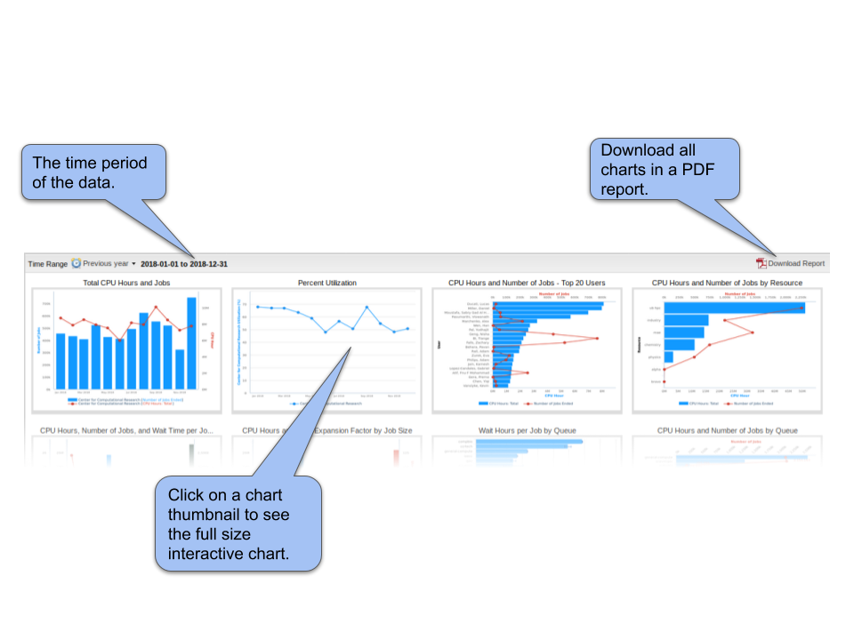
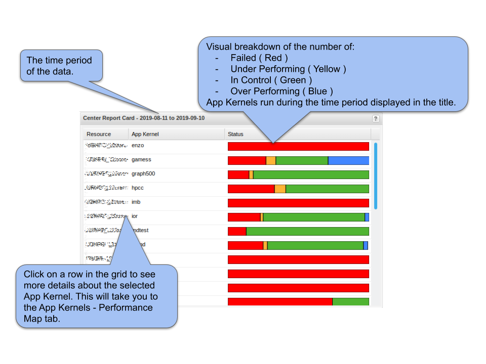
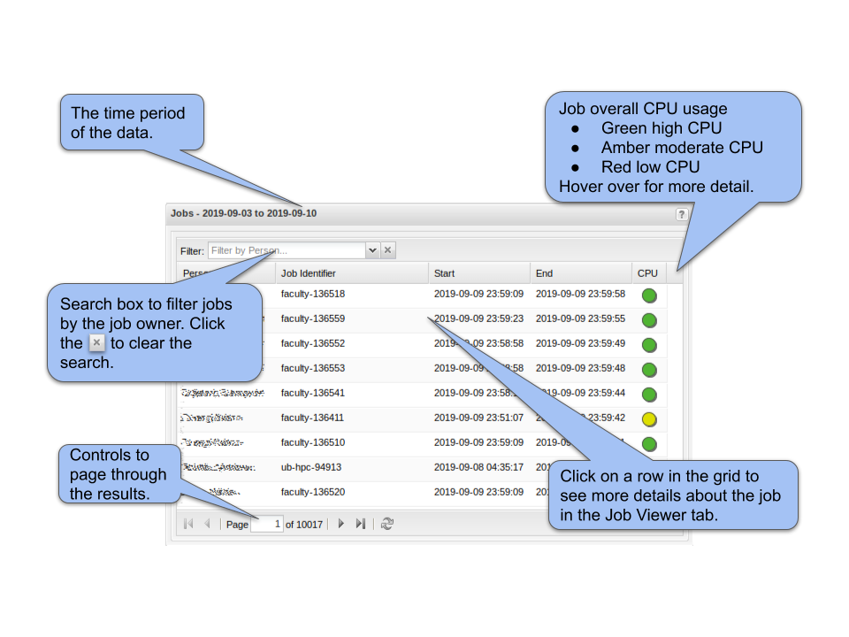
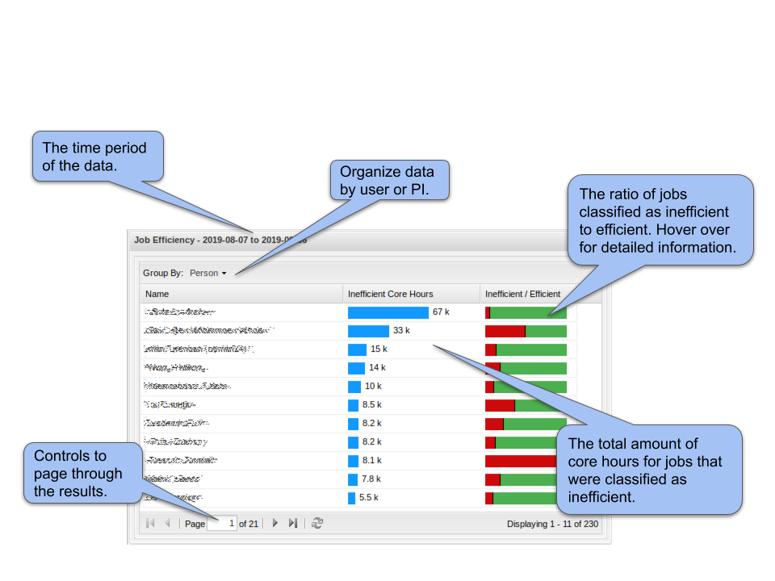
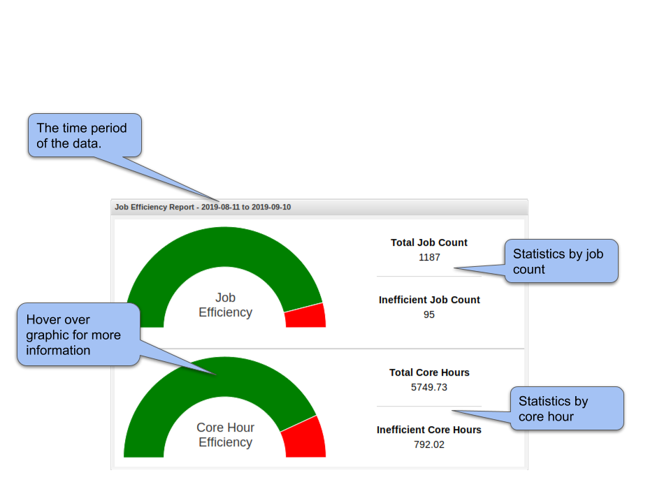

Dashboard Tab
===============

:only:`<Open>The dashboard tab is an optional replacement for the summary tab.
The dashboard must be enabled by the XDMoD system administrator and is
only available for logged in users.` :only:`<XSEDE>The dashboard tab is
the first tab displayed to logged in users.` It displays various
information in separate display windows called components. The
information displayed in the dashboard varies according to the assigned
role of each user account. :only:`<Open>{open_dashboard_user_role}`:only:`<XSEDE>{xsede_dashboard_user_role}`
lists the default settings for each role.

.. TODO: fix Open table. should be that each entry in xdmod module is either a module name or dash to indicate
   no requirement for a module

.. only:: Open

   .. _open_dashboard_user_role:

   .. table:: List of dashboard components by user role. Some of the components are only available if the (optional) XDMoD module is installed

      +-----------------------+-----------------------+-----------------------+
      | **Role**              | **Components          | **XDMoD module**      |
      |                       | Displayed**           |                       |
      +=======================+=======================+=======================+
      | Center Director       | Center summary        |    \-                 |
      |                       |                       |                       |
      |                       | Saved charts and      |    \-                 |
      |                       | reports               |                       |
      |                       |                       |    Application        |
      |                       | Center Report Card    |    Kernels            |
      +-----------------------+-----------------------+-----------------------+
      | Center Staff          | Center summary        |    \-                 |
      |                       |                       |                       |
      |                       | Saved charts and      |    \-                 |
      |                       | reports               |                       |
      |                       |                       |    SUPReMM            |
      |                       | Job Efficiency Report |                       |
      |                       |                       |    \-                 |
      |                       | Recent jobs           |                       |
      |                       |                       |    Application        |
      |                       | Center Report Card    |    Kernels            |
      +-----------------------+-----------------------+-----------------------+
      | Principal             | Recent jobs           |    \-                 |
      | Investigator          |                       |                       |
      |                       | Job Efficiency Report |    SUPReMM            |
      |                       |                       |                       |
      |                       | Summary Charts        |    \-                 |
      +-----------------------+-----------------------+-----------------------+
      | User                  | Recent jobs           | \-                    |
      |                       |                       |                       |
      |                       | Job Efficiency Report | SUPReMM               |
      |                       |                       |                       |
      |                       | Summary Charts        | \-                    |
      +-----------------------+-----------------------+-----------------------+

.. only:: XSEDE

   .. _xsede_dashboard_user_role:

   .. table:: List of dashboard components by user role.

      +-----------------------------------+-----------------------------------+
      | **Role**                          | **Components Displayed**          |
      +===================================+===================================+
      | Program Officer                   | Center Summary (all Centers)      |
      |                                   |                                   |
      |                                   | Saved charts and reports          |
      |                                   |                                   |
      |                                   | Center Report Card (all Centers)  |
      +-----------------------------------+-----------------------------------+
      | Center Director                   | Center summary                    |
      |                                   |                                   |
      |                                   | Saved charts and reports          |
      |                                   |                                   |
      |                                   | Center Report Card                |
      +-----------------------------------+-----------------------------------+
      | Principal Investigator            | Recent jobs                       |
      |                                   |                                   |
      |                                   | Job Efficiency Report             |
      |                                   |                                   |
      |                                   | Summary Charts                    |
      +-----------------------------------+-----------------------------------+
      | User                              | Recent jobs                       |
      |                                   |                                   |
      |                                   | Job Efficiency Report             |
      |                                   |                                   |
      |                                   | Summary Charts                    |
      +-----------------------------------+-----------------------------------+

The various dashboard components are described below.

Dashboard Components Overview
---------------------------------

There are two categories of dashboard components: full-width components
and half-width components. Full width components are in a fixed location
at the top of the dashboard tab and the half-width components are
arranged in columns. All half-width components have a title bar such as
the example shown in :numref:`dashboard_title_bar`. The title bar includes the name of
the component and, for components that show data limited by time. show
the date range of the data. Clicking the question mark icon on the right
of the title bar will show a help window that explains how to use the
component.

   Example title bar of a dashboard component. Typically
   the title includes information about the date range of the data. The
   question mark button on the top right is used to open a help window.
   Some components also have additional icons for component-specific
   features.

The layout of the half-width dashboard components can be customized by
dragging the title bar of a component (:numref:`dashboard_rearrange_layout`). The layout
settings are saved automatically and persist between logins. The layout
can be reset to default using the **Reset to default** button in the
**Settings** tab of the **My Profile** dialog (:numref:`dashboard_reset_default`).
The **My Profile** dialog is accessed via the **My Profile** button on the top
right of the XDMoD portal. Full-width dashboard components cannot be moved.

   Example of rearranging the layout of half-width
   dashboard components. A component can be moved by selecting the title
   bar and dragging into the new position.

   The dashboard layout can be reset to the default value
   using the button available in the **Settings** tab of the **My Profile**
   dialog.

Chart Component
-------------------

The Chart Component shows charts from the Metric Explorer. An example of
the chart component is shown in :numref:`chart_component`. The time range of the
chart is shown in the title bar. The wheel icon on the top right of the
component will open the chart in the Metric Explorer.

   Example of a chart component. The time range of the
   chart is shown in the title bar. The wheel icon on the top right will
   open the chart in the Metric Explorer.

The default chart configuration settings are controlled by the
:only:`<Open>Open` XDMoD system administrator. Extra charts can be added
to the dashboard via the Metric Explorer. Charts are added via the **Show
in Summary tab** checkbox in the Metric Explorer basic chart options (see
:numref:`Section %s<basic_chart_options>` for more information).

It is also possible to edit the default charts via the Metric Explorer.
Click the wheel icon on the top right of the chart component to open the
chart in the Metric Explorer. You can then edit the chart in the Metric
Explorer and save the chart *without* changing the chart name field or
deselecting the **Show in Summary tab** checkbox. To reset a system chart
to the default just delete it from the list of save charts in the Metric
Explorer.

Saved Charts and Reports Component
--------------------------------------

.. could make section ref either have full "section # - name" or just "name"

:numref:`saved_charts_and_reports` shows the saved charts and reports component. This
component lists a user’s charts that were saved in
:numref:`Section %s - Metric Explorer<metric_explorer>`
and their reports from
:numref:`Section %s - Report Generator<report_generator>`.
The list can be sorted by the name,
type (chart or report), and last modification date. By default, the list
is sorted by the last modification date in descending order. The user
can filter the list by name by using the search box.

   **Shows the saved charts and reports components.**

Center Summary Component
----------------------------

:numref:`center_summary_report` shows the center summary component. This component
displays the thumbnails of charts from the center summary report that is
tailored based on user role. Clicking on a thumbnail opens a modal
containing an interactive version of the chart. The user can open the
chart in Metric Explorer to modify it. Note that charts modified in
Metric Explorer have to be saved and added to the center summary report
in order to be displayed as a thumbnail in the center summary component.
The user can control the time period of the charts by using the time
range menu. The user can also download the charts as a PDF by clicking
the Download Report button.

   The center summary report shows thumbnails of charts
   from the center summary report that is tailored based on user role.

Center Report Card
----------------------

The center report card component is provided by the optional XDMoD
AppKernels module. The component shows a summary of the results of
recent application kernel jobs. :numref:`center_report_card` shows an annotated
example of the center report card.

   An annotated example of the Center Report
   Card component that is available in the optional AppKernels module.

Jobs Component
------------------

The Jobs component displays information about recent HPC jobs. An
annotated example is shown in :numref:`jobs_component`. The job information is
based on the Job Performance (SUPReMM) realm if the Job Performance
module is installed. If the Job Performance module is not installed then
the data are obtained from the Jobs realm and the component will display
‘N/A’ in the CPU column indicating that the cpu usage is not available.
The information displayed in the Jobs component is restricted by XDMoD’s
role based access controls. A summary of the data available is shown in
:only:`<Open>{open_account_restrictions}`:only:`<XSEDE>{xsede_account_restrictions}`
below. The **Filter by Person** widget is not displayed for
the user role since it is superfluous.

   Annotated example of the Jobs component. The User role
   does not have permission to list other users jobs and does not have the
   **Filter by Person** widget. The Job overall CPU usage information is
   only available if the optional Job Performance (SUPReMM) XDMoD module is
   installed.

.. only:: Open

   .. _open_account_restrictions:

   .. table:: Summary of the role based access control restrictions for data shown in the job component.

      +-----------------------------------+-----------------------------------+
      | **XDMoD account role**            | **Information available**         |
      +===================================+===================================+
      | User                              | HPC jobs that were run by the     |
      |                                   | user.                             |
      +-----------------------------------+-----------------------------------+
      | Principal Investigator            | HPC jobs that were run by the     |
      |                                   | user and HPC jobs that were run   |
      |                                   | on the PIs projects.              |
      +-----------------------------------+-----------------------------------+
      | Center Staff                      | All HPC job data.                 |
      +-----------------------------------+-----------------------------------+
      | Center Director                   | All HPC job data.                 |
      +-----------------------------------+-----------------------------------+

.. only:: XSEDE

   .. _xsede_account_restrictions:

   .. table:: Summary of the role based access control restrictions for data shown in the job component.

      +-----------------------------------+-----------------------------------+
      | **XDMoD account role**            | **Information available**         |
      +===================================+===================================+
      | User                              | ACCESS HPC jobs that were run by  |
      |                                   | the user.                         |
      +-----------------------------------+-----------------------------------+
      | Principal Investigator            | ACCESS HPC jobs that were run by  |
      |                                   | the user and HPC jobs that were   |
      |                                   | run on the PIs projects.          |
      +-----------------------------------+-----------------------------------+
      | Center Staff                      | All HPC job data for the Center   |
      |                                   | and all ACCESS jobs run by the    |
      |                                   | user.                             |
      +-----------------------------------+-----------------------------------+
      | Center Director                   | All HPC job data for the Center   |
      |                                   | and all ACCESS jobs run by the    |
      |                                   | user.                             |
      +-----------------------------------+-----------------------------------+
      | Campus Champion                   | All ACCESS HPC job data for users |
      |                                   | at the same Institution and all   |
      |                                   | ACCESS HPC jobs run by the user.  |
      +-----------------------------------+-----------------------------------+
      | Program Officer                   | All data                          |
      +-----------------------------------+-----------------------------------+

Job Efficiency Component
----------------------------

The Job Efficiency component is only available if the Job Performance
module is installed. The Job efficiency in XDMoD is defined based on a
comparison of the resources (CPU, Memory, etc.) requested to those used
by an HPC job. The information in the Job Efficiency component is
subject to the same role-based access controls as the Jobs component as listed in
:only:`<Open>{open_account_restrictions}`:only:`<XSEDE>{xsede_account_restrictions}`.
An annotated example of the component view for
Center Staff and Center Director roles is shown in :numref:`job_efficiency_1`. The
Principal Investigator role does not have a toolbar that switches the
data grouping between user and PI. The User role example is shown in
:numref:`job_efficiency_2`.

   Annotated example of the Job Efficiency component. The
   total number of jobs and core hours are shown broken down by efficiency
   categorization. Click on a row in the table to open a window that lists
   the jobs that were classified as inefficient.

   Annotated example of the Job Efficiency component for
   XDMoD accounts with User role. The total number of jobs and core hours
   are shown broken down by efficiency categorization. Click on the bar
   chart to show the information about the jobs that are summarized.

.. only:: XSEDE

   Allocations Component
   -------------------------

   The Allocations Component shows a summary of allocation information. An
   example of the Allocations Component is shown in :numref:`allocations_component` below.
   Clicking on the component will load the Allocations Tab

   .. figure:: media/image116.png
      :name: allocations_component

      Allocations Component
