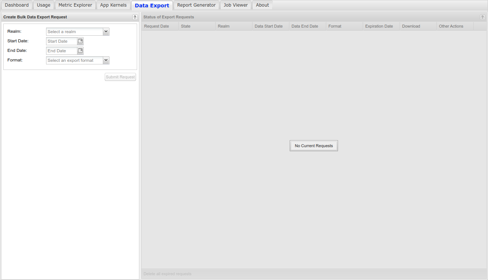
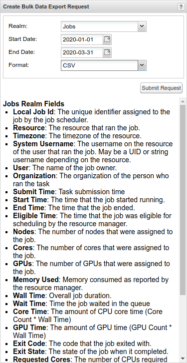
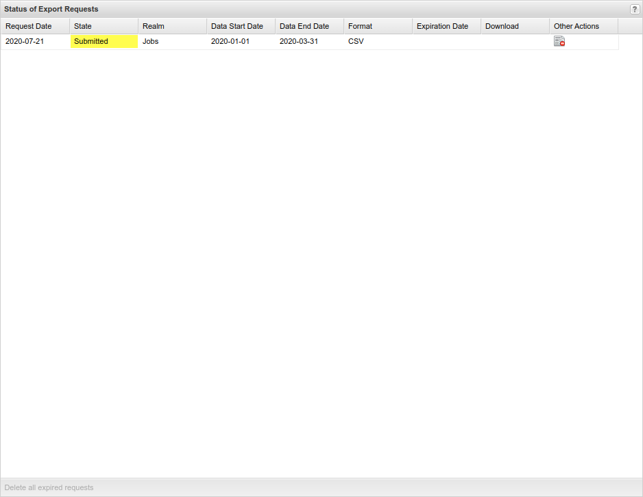

Data Export
==============

To manage data export requests, click on the **Data Export** tab
(:numref:`data_export_tab`).

The Data Export functionality allows you to request batch exports of
non-aggregate records from the data warehouse. These requests are
limited to a one year duration, but there is no limit to the number of
requests. The exported data can be formatted as either CSV or JSON.
Submitted requests are typically fulfilled within 24 hours and an email
is sent to notify you that your data is ready for download.

The Data Export tab appears as shown below with a form used to create
requests (:numref:`data_export_create_request_panel`) on the left and a list of existing requests
(:numref:`data_export_status_panel`) on the right.

   Data Export Tab

Create Data Export Request
-------------------------------

To create a new request fill out the form and the left and click the
button. When a realm is selected the list of fields that will be
exported are displayed below the form. A start date, end date and format
must be selected. The maximum duration is one year. The export formats
are CSV and JSON. The JSON export is structured as an array of arrays.

   Data Export Create Request Panel

Manage Existing Export Requests
------------------------------------

After submitting a request it will be added to the list in the
"Submitted" state. The request may be deleted before it is fulfilled.

   Data Export Status Panel

Requests are fulfilled on a set schedule and emails are sent to notify
you that your data is ready for download. The email will include a link
that can be used to download the file and the file will also be
available to download through the web portal. The file is retained for a
set amount of time, typically 30 days. The expiration date will be
displayed in both the email and the web portal. After this date the file
will no longer be available for download, but the request may be
resubmitted.
