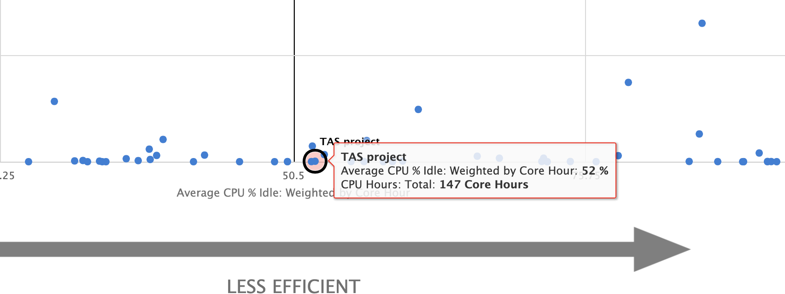

Efficiency
=============

The Efficiency Tab displays information about the efficiency of jobs
running on the resources at your center. The initial display (:numref:`efficiency_tab`)
shows analytic cards that each have a small description of the
analytic and a thumbnail view of a scatter plot showing efficiency
regarding that specific analytic. The scatter plots are intended to give
you a quick view of which analytics need to be investigated more for
poor efficiency.

.. figure:: media/image42.png
   :name: efficiency_tab

   Efficiency Tab. The efficiency tab shows analytic cards
   when you first navigate to the tab which give efficiency information
   about users’ jobs at your center.

A larger, interactive view of the scatter plot can be seen by clicking
on the analytic that you want to learn more about (:numref:`efficiency_interactive_scatter_plot`). The
scatter plots are described in more detail in
:numref:`Section %s - Scatter Plot View <scatter_plot_view>`.

   When you click on one of the analytic cards, you will
   be redirected to the scatter plot view.

Analytics are categorized into two bins - analytics associated with
usage and analytics associated with design. Usage analytics compare
resources allocated for a job to measured usage for the job. Design
analytics determine if jobs are using resources in an efficient manner
consistent with their design. :numref:`efficiency_analytics_table` below lists the available
analytics and the associated description for each analytic.

.. _efficiency_analytics_table:

.. table:: Analytics available for display in the Efficiency Tab.

   +--------------+-------------------------------------------+--------------+
   | **Analytic** | **Description**                           | **Category** |
   +==============+===========================================+==============+
   | CPU Usage    | Measures the percentage of time that the  | Usage        |
   |              | CPU cores were idle.                      |              |
   +--------------+-------------------------------------------+--------------+
   | GPU Usage    | Measures the percentage of time that the  | Usage        |
   |              | GPUs were busy.                           |              |
   +--------------+-------------------------------------------+--------------+
   | Memory       | Measures the overall highest memory usage | Usage        |
   | Usage        | for jobs.                                 |              |
   +--------------+-------------------------------------------+--------------+
   | Homogeneity  | Measures how uniform the work rate of the | Usage        |
   |              | job is.                                   |              |
   +--------------+-------------------------------------------+--------------+
   | Wall Time    | Measures how well used wall time matches  | Design       |
   | Accuracy     | requested wall time.                      |              |
   +--------------+-------------------------------------------+--------------+
   | Short Jobs   | Measures the number of jobs that ran for  | Design       |
   |              | 30 seconds or less.                       |              |
   +--------------+-------------------------------------------+--------------+

.. _scatter_plot_view:

Scatter Plot View
-----------------------

This view shows a larger, interactive scatter plot for the analytic
selected by clicking on its corresponding analytic card. For example,
:numref:`efficiency_scatter_plot_view` shows the CPU Usage Scatter Plot View.

All scatter plots are initially the same as the thumbnail plot in the
previous view, but you have the ability to apply filters, zoom in, and
drill down in this view. Each point on each of the scatter plots
represents data for the jobs of a particular user with the efficiency
statistic plotted on the x-axis and the overall usage plotted on the
y-axis. :numref:`efficiency_scatter_statistics` shows the analytics and their associated
efficiency and usage statistics that are plotted in the scatter plots.

   Scatter Plot View. This view displays a larger scatter
   plot that allows drill downs and filters to be applied. The view also
   includes help text to give more context about the analytic and ideas for
   improving efficiency in regard to this analytic.

.. _efficiency_scatter_statistics:

.. table:: Statistics that are plotted for each of the analytics in the scatter plots.

   +-----------------------+-----------------------+-----------------------+
   | **Analytic**          | **Scatter Plot        |                       |
   |                       | Statistics**          |                       |
   +=======================+=======================+=======================+
   |                       | **Efficiency          | **Usage Statistic**   |
   |                       | Statistic**           |                       |
   +-----------------------+-----------------------+-----------------------+
   | CPU Usage             | Average CPU % Idle:   | CPU Hours: Total      |
   |                       | Weighted by Core Hour |                       |
   +-----------------------+-----------------------+-----------------------+
   | GPU Usage             | Average GPU % Active: | GPU Hours: Total      |
   |                       | Weighted by GPU Hour  |                       |
   +-----------------------+-----------------------+-----------------------+
   | Memory Usage          | Avg: Max % Memory:    | CPU Hours: Total      |
   |                       | Weighted by Core Hour |                       |
   +-----------------------+-----------------------+-----------------------+
   | Homogeneity           | Avg: Homogeneity:     | CPU Hours: Total      |
   |                       | Weighted by Node-Hour |                       |
   +-----------------------+-----------------------+-----------------------+
   | Wall Time Accuracy    | Wall Time Accuracy    | Wall Time Allocated   |
   +-----------------------+-----------------------+-----------------------+
   | Short Jobs            | Number of Short Jobs  | Total Number of Jobs  |
   |                       | (<30s)                | Ended                 |
   +-----------------------+-----------------------+-----------------------+

Points higher on the y-axis represent more usage and points on the left
hand side of the plot correspond to a high measured usage. The upper
right hand quadrant of each scatter plot represents users with jobs that
have a lot of usage on the system and are running inefficiently in
regard to that analytic. A tooltip appears (:numref:`efficiency_tooltip`) when you
mouse over a point to show the user name (if you have access), the
efficiency statistic value, and the usage statistic value.

   A tooltip giving information

about the user, their efficiency, and

usage of their jobs appears when you

mouse over a point in the scatter plot.

You can use these to compare efficiency of your jobs against other
users’ jobs at the same center. If you have access to the user, you are
able to click on their point on the scatter plot to drill down and view
more information about that user’s jobs’ efficiency (:numref:`efficiency_histogram_1`).
When you drill down, you will be presented with a histogram chart
(:numref:`efficiency_histogram_2`) which is described in
:numref:`Section %s - Histogram View <histogram_view>`.

   Clicking on a point in the scatter plot that you are
   allowed access to will take you to the histogram view for that user
   which shows more information about that user’s jobs.

There are slight variations to the scatter plot view you will see
depending on the user access that you have. These are described below in
:numref:`Section %s <center_staff_view>` and :numref:`Section %s <pi_or_normal_user_view>`
The main differences between the views are
the markers used on the scatter plot and the ability to drill down and
learn more about a user’s jobs. The markers are shown in :numref:`efficiency_user_markers`.

.. figure:: media/image2.png
   :name: efficiency_user_markers

   Different markers used to indicate users on the scatter plot.

.. _center_staff_view:

Center Staff View
~~~~~~~~~~~~~~~~~~~~~~~~~~~~

Center staff can view all users at the center that have data to be
displayed on the scatter plot. Each user is marked with either a red
or blue marker on the scatter plot. A red marker indicates a user
that has been flagged as running jobs inefficiently in regard to the
analytic that is being shown. A blue marker indicates a normal user.
As center staff, you have access to all users and therefore have the
ability to view all names in the tooltips and drill down on any user
in the scatter plot to learn more about the jobs that they are
running.

.. _pi_or_normal_user_view:

PI or Normal User View
~~~~~~~~~~~~~~~~~~~~~~~~~~~~~~~~~

PIs have access to their own point as well as points that represent
their users. This is indicated by a black circle around the points
that you have access to. Normal users only have access to their own
data and therefore can only drill down on their own point.

.. TODO: ref sections

The data that appears in the scatter plot can be altered by changing
duration and applying filters. Applying filters to the scatter plot is
described in :numref:`Section %s - Filtering Charts <filtering_charts>`
and changing duration is described in :numref:`Section %s - Selecting Duration of Charts <selecting_duration_of_charts>`.

.. _histogram_view:

Histogram View
-------------------

If you have access to view information about a specific user, you can
drill down to the histogram view from the scatter plot view. The
histogram view for each analytic gives a more detailed analysis of a
specific user’s jobs in relation to the analytic that is being
investigated. For example, :numref:`efficiency_histogram_2` shows the histogram view for
the CPU Usage analytic.

   Histogram view. This view gives a more detailed view of
   a specific user’s jobs.

If you were to drilldown from the CPU Usage scatter plot on a specific
user, you would see their jobs binned by the CPU User value compared to
the overall CPU Usage for jobs in that bin. The bins are color coded
according to efficiency and the color coding is unique to the analytic
that is being displayed. However, in each histogram view red is
associated with jobs that were running more inefficiently while green is
associated with jobs that were running more efficiently.

The histogram chart can be modified to learn more information about the
user’s jobs. You can change the duration of the data included in the
histogram by using the duration selector toolbar as described in
:numref:`Section %s - Filtering Charts <filtering_charts>`
and filters can be applied to the chart as described in
:numref:`Section %s - Selecting Duration of Charts <selecting_duration_of_charts>`.

To learn more information about the user’s jobs that were included in
each of the bins, you can click on any of the bars in the plot that have
data in them. Clicking on them will bring up a window that lists all
jobs that were grouped in the category that you are viewing (:numref:`efficiency_histogram_bin`).

   Clicking on a bin in the histogram plot will bring up a
   list of all jobs that were binned in this category.

Job List
--------------

As shown in :numref:`efficiency_histogram_bin`, a job list window will appear when you
click on one of the bars from the histogram plot (as described in
:numref:`Section %s - Histogram View <histogram_view>`). The job list window for each
analytic varies slightly concerning the data that is shown in the
window.

You can click on a row in the job list table to view that job in the Job
Viewer (:numref:`efficiency_job_viewer`). When you click on a job, you will be
redirected to the Job Viewer tab with that job showing. This will
provide you with more details about the job.

   Clicking on a row in the job list table will take you
   to the Job Viewer for that job.

.. _filtering_charts:

Filtering Charts
-------------------------------

   Filter Menu.** Select filters you want to apply to the
   chart from this menu and apply these using the “Apply Filters to Chart”
   button.

In addition to drilling down on the charts to get more information, you
can also filter the results that you see on the scatter plot and drill
down charts. In both cases, you use the filter menu on the left hand
side of the chart to apply filters. There is filtering available for
four categories - queue, application, resource, and PI. You can choose
filters by either checking the box that corresponds with the filter that
you want to apply or by searching the filter in the search box of the
category you are interested in and clicking on the filter that you want
to apply from the dropdown box.

Once all filters that you want to apply are checked, click on the Apply
Filters button in the top of the filter menu to apply those filters to
the chart that you are looking at. The chart will reload and filters
that have applied will be listed in the subtitle (:numref:`effiency_chart_filters`).

   Filters that have applied to the chart will be listed
   in the subtitle of the chart.

To remove all filters, click on the Remove Filters button at the top of
the filter menu and the chart will be reloaded with no filters applied.
If you only want to remove a select number of filters from a chart that
has filters previously applied, you will need to uncheck the filters in
the filter menu and click the Apply Filters button again.

Note: If you change the duration of the plot that you are viewing,
filters will remain applied as reflected by the filters listed in the
subtitle. To remove filters, use the Remove Filters from Chart button at
the top of the filter menu.

.. _selecting_duration_of_charts:

Selecting Duration of Charts
-------------------------------------------

.. figure:: media/image21.png
   :name: efficiency_duration_selection_toolbar

   Duration Selection Toolbar.** Use this toolbar

By default all charts show data from the previous 30 days. You can
change this duration for any of the views at any time to view data from
a different time frame. In each view, there is a duration selection
toolbar present in the upper toolbar (:numref:`efficiency_duration_selection_toolbar`). You can choose
a pre-defined timeframe from the duration drop-down menu, or specify a
start and end date in the date fields to the right of the drop-down menu
to select a custom timeframe.

to select a timeframe for the chart that you are viewing.

Navigation in Efficiency Tab
----------------------------------

To move forward in the efficiency tab, you click on elements within the
current view you are on. For the analytic card view, you click on an
analytic card to navigate to the scatter plot view. For the scatter plot
view, you click on a point on the chart to move to the drilldown view
(this is only true for users that you have access to view their jobs).

   Navigation Toolbar. Use the navigation toolbar to
   navigate between views in the efficiency tab. Clicking on any of the
   enabled buttons will take you back to that view.

To move back to previously viewed plots, you use the navigation buttons
in the top toolbar next to the duration toolbar (:numref:`efficiency_navigation_toolbar`). A
new navigation button will be enabled as you move through the different
chart views and you can click on the corresponding button to go back to
a chart view that you were previously on.
