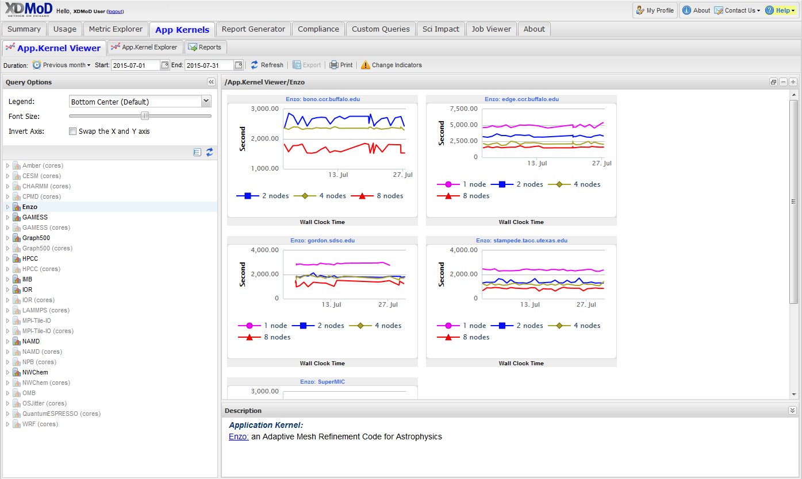
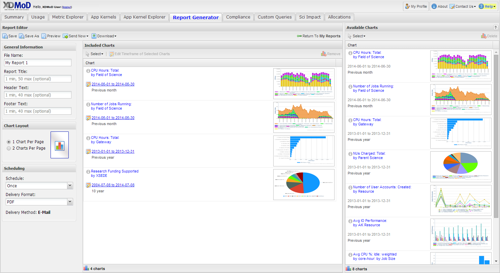
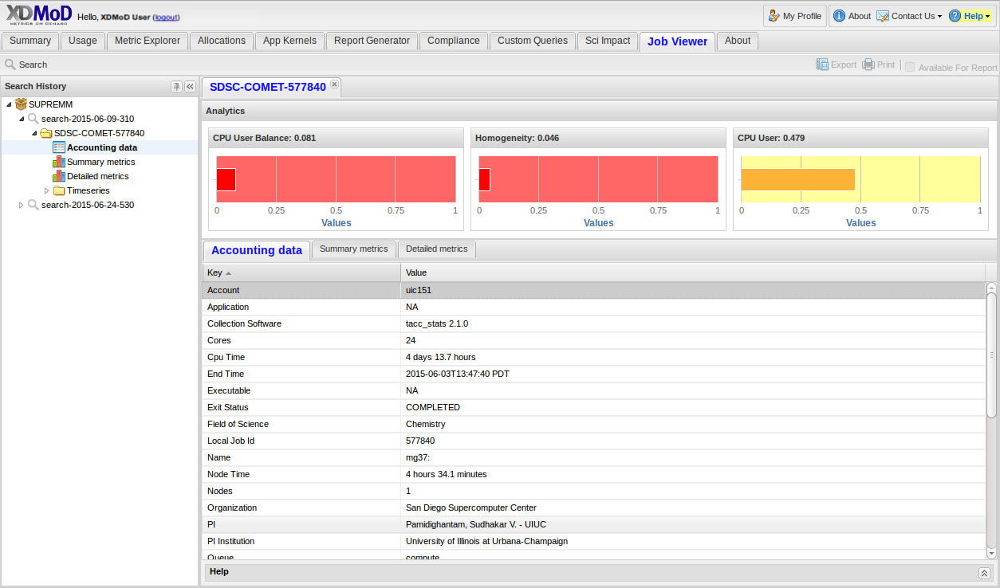

Introduction
==============

XD Metrics on Demand (XDMoD) provides metrics pertaining to resource
utilization and performance of high performance computing (HPC)
resources, and the impact these resources have in terms of scholarship
and research. While initially focused on the National Science Foundation
(NSF) TeraGrid and follow-on `XSEDE <https://www.xsede.org/>`__ (XD) and
`ACCESS <https://access-ci.org/>`__ programs, XDMoD has a wide
applicability to any HPC system. The goals of XDMoD framework are to

1. Provide the end-user community with a tool to more effectively and
efficiently use their allocations and optimize their use of
cyber-infrastructure (CI) resources.

2. Provide operational staff with the ability to monitor and tune the
performance of hardware , system software, and applications to ensure
optimal resource performance.

3. Provide management with a diagnostic tool to facilitate CI planning
and analysis as well as monitor resource utilization and performance.

4. Provide metrics such as publications, awards, and citations to help
ensure that the resources are effectively enabling research and
scholarship.

The framework also provides a computationally lightweight and flexible
application kernel auditing system that reflects best-in-class
performance kernels to measure overall system performance with respect
to existing applications that are being run by users. This allows
continuous resource usage analysis and measurement of all aspects of
system performance, including: global file-system performance, local
processor-memory bandwidth, allocable shared memory, processing speed,
and network latency and bandwidth.

.. only:: XSEDE

   Metrics that focus on scientific impact, such as publications and external funding, are also
   included to help demonstrate the important role such centers play in
   advancing research and scholarship as well as to help justify the
   continued investment in these resources.

XDMoD User Interface Overview
---------------------------------

Here we provide a brief introduction to the XDMoD user interface.
Greater detail is provided throughout the manual. The XDMoD user
interface, shown in :only:`<XSEDE>{xsede_sum_tab}`:only:`<Open>{open_sum_tab}`, is organized into multiple tabs that
provide functionality tied to the role of the user.

XDMoD utilizes user roles to restrict access to data and elements of the
user interface such as tabs. Supported roles include a public
(unauthenticated user), User, Principal Investigator, and Center
Director. A detailed description of each role as it applies to data
access is as follows.

.. only:: XSEDE

   In addition, the ACCESS version of XDMoD includes a Campus
   Champion and Program Officer roles.

*Public Role:* With no user account required, the public role provides
non-authenticated users with access to overall utilization broken down
by center or service provider (if more than one are available),
resource, field of science, allocation time, etc.; and the ability to
view specific time periods, and export images. Quality of service data
via the Application Kernel suite is not publically available, nor is
specific user data.

*User:* Users are able to view all data available to the Public Role as
well as their personal utilization information. They are also able to
view information regarding their allocations, quality of service data
via the Application Kernel Explorer, and generate custom reports.

*Principal Investigator (PI):* A principal investigator is a user who is
listed as a PI on one or more allocation or project. A PI has access to
all data available to a user, as well as detailed information for any
users included on their allocations or project.

.. only:: XSEDE

   *Campus Champion:* The campus champion role is still a work in
   progress. A typical campus champion will include one or more users on
   their allocations while assisting them, giving the champion the same
   access to detailed information about those users that a PI would have.
   we will be collaboration with the Campus Champion working group to
   develop other tools to facilitate their work in the future.

*Center Director/Center Staff:* The director of a service provider or
center will have access to detailed usage information for any user that
has run jobs at their center. In addition, they will have access to
detailed application kernel results for runs at their center. Directors
are also able to delegate access to their center’s data to other users
who assist in the operations of their center. Directors may also have
access to other information for their center to ensure that the proper
information is being consistently reported.

.. only:: XSEDE

   *Program Officer/ACCESS Management:* Program Officers and ACCESS
   management have no restrictions on the information available to them.
   They may view data across all service providers, including data
   reporting compliance reports and custom queries (both described
   below).

The **XDMoD User Interface** contains a wealth of information and has
been organized into tabs to compartmentalize the data without
overwhelming the user. For illustrative purposes, we will focus on the
highest level role. :only:`<XSEDE>The tabs which are described in greater
detail below are: Summary tab, Usage tab, Metric Explorer tab,
Allocations tab, App Kernels tab, Report Generator tab, Custom Query
tab, Job Viewer tab, and Compliance tab.` :only:`<Open>The tabs which
are described in greater detail below are: Summary tab, Usage tab,
Metric Explorer tab, App Kernels tab, Job Viewer tab, and Report
Generator tab`

The :ref:`summary_tab` :only:`<XSEDE>({xsede_sum_tab})` :only:`(<Open>{open_sum_tab})`
provides a snapshot overview of selected data with several small summary charts visible that can be
expanded to full size charts through a simple mouse click. The default
is to show utilization over the previous month, but the user may select
from a number of preset date ranges (week, month, quarter, year to date,
etc) or choose a custom date range. The user can also customize the
summary by adding charts, see the section on the :ref:`metric_explorer`

.. only:: XSEDE

   .. figure:: media/image58.png
      :name: xsede_sum_tab

      **XDMoD Summary Tab**. Summary tab contains a series of user configurable summary
      plots of usage. In this case the summary summary plots are for all XSEDE in 2012.

.. only:: Open

   .. figure:: media/image88.png
      :name: open_sum_tab

      **XDMoD Summary Tab**. Summary tab contains a series of user
      series of user configurable summary plots of usage.

.. only:: XSEDE

   The **Usage tab**, shown in :numref:`xsede_usage_tab`, provides access to an
   expansive set of resource-wide metrics that are accessible through the
   tree-structure on the left-hand side of the portal window, including
   summaries of usage, allocations, accounts, and SUPReMM performance data.
   Usage metrics provided by XDMoD include: number of jobs, total and
   average SUs (service units) charged, total and average NUs (normalized
   units) provided, number of CPUs used, wait time, wall time, minimum,
   maximum and average job size, average CPU used, average wall time,
   average wait time and user expansion factor. In addition a suite of
   SUPReMM performance metrics are available for most resources. These
   metrics can be broken down by: field of science, gateway, institution,
   job size, job wall time, NSF directorate, NSF user status, parent
   science, person, principal investigator, and by resource. Many of the
   plots are context sensitive and allow users to click on a data element
   within the plot to further analyze the data. For example, in :numref:`xsede_usage_tab`,
   which shows the distribution of total CPU hours by job size in
   2012 for all of XSEDE, one can click on any of the columns to obtain a
   more detailed analysis for the selected job size range. The plot can
   also be made available to the custom report generator by clicking the
   box that reads “Available For Report”. It can also be exported in either
   PNG (portable network graphics), PDF (portable document format) or SVG
   (scalable vector graphics) format. The data itself can be exported in
   either CSV (comma separated values) or XML (extensible markup language)
   format.

.. only:: Open

   The Usage tab, shown in :numref:`open_usage_tab`, provides access to an
   expansive set of resource-wide metrics that are accessible through the
   tree-structure on the left-hand side of the portal window, including
   summaries of usage, allocations, accounts, and performance data, as well
   as allocations and accounts. Usage metrics provided by XDMoD include:
   number of jobs, total and average CPU-hours charged, number of CPUs
   used, wait time, wall time, minimum, maximum and average job size,
   average CPU used, average wall time, average wait time and user
   expansion factor. If installed, a suite of SUPReMM performance metrics
   may also be available. These metrics can be broken down by: job size,
   job wall time, person, principal investigator, by resource, and by
   organizational hierarchy (if available). Many of the plots are context
   sensitive and allow users to click on a data element within the plot to
   further analyze the data. For example, in :numref:`open_usage_tab`, which shows
   the distribution of total CPU hours by job size in 2012, one can click
   on any of the columns to obtain a more detailed analysis for the
   selected job size range. The plot can also be made available to the
   custom report generator by clicking the box that reads “Available For
   Report”. It can also be exported in either PNG (portable network
   graphics), PDF (portable document format) or SVG (scalable vector
   graphics) format. The data itself can be exported in either CSV (comma
   separated values) or XML (extensible markup language) format.

.. only:: XSEDE

   .. figure:: media/image36.png
      :alt: Usage_Overview.png
      :name: xsede_usage_tab

      **XDMoD Usage Tab.** A Usage plot showing the total CPU hours
      broken out by job size on all XSEDE resources for 2012.

.. only:: Open

   .. figure:: media/image135.png
      :name: open_usage_tab

      **XDMoD Usage Tab**. A Usage plot showing the total CPU hours
      broken out per job on all available resources.

The :ref:`metric_explorer` tab provides a powerful tool for organizing and
comparing the data from a wide variety of metrics. The Metric Explorer
tab, which also provides access to all of the metrics available through
the Usage tab, facilitates comparison among the various metrics by
allowing multi-axis plots, as shown in :only:`<XSEDE>{xsede_metric_explorer_1} Displayed
in the window is a plot that shows the number of jobs (left hand axis)
and average core count (right hand axis) broken down by NSF Directorate
in 2012 for all XSEDE resources. Biological Sciences rival Mathematical
and Physical Sciences in total number of jobs but the biological-based
jobs tend to use a smaller number of processors on average. As shown in
{xsede_metric_explorer_2}, the data can be filtered in a variety of ways to display
only a desired subset of the data. For example, the plot shown in
{xsede_metric_explorer_2} was generated from {xsede_metric_explorer_1} by applying a filter to
display only the “NICS-KRAKEN” data. It is interesting to note that on
Kraken, Geosciences has surpassed Biological Sciences in terms of the
total number of jobs run and has a much higher average core
count.` :only:`<Open> Displayed in the window is a plot that shows the
number of jobs (left hand axis) and average core count (right hand axis)
for all available resources. As shown in {open_metric_explorer_2}, the data can be
filtered in a variety of ways to display only a desired subset of data.
For example, the plot shown in {open_metric_explorer_2} was generated from
{open_metric_explorer_1} by applying a filter to display only the resource:
chemistry.` A notable feature is the ability to open a metric
that is provided on the Usage tab directly in the Metric Explorer by
clicking on the gear icon on the top right of the plot. This allows one
to utilize an existing plot as a starting point and easily customize it,
configure additional data series for comparison, and save it for use in
a report. Taken in its entirety, the Metric Explorer provides a powerful
and flexible interface to facilitate analysis of the data.

.. only:: XSEDE

   .. figure:: media/image9.png
      :alt: Metric Explorer_Overview.png
      :name: xsede_metric_explorer_1

      **The XDMoD Metric Explorer Tab.** *Plot shows the number of jobs
      running for each NSF Directorate vs average core count for June
      2014 on all available resources. Number of jobs running is shown
      on the primary axis (left-hand axis) and average core count
      (weighted by each job's total SU’s charged) is shown on the
      secondary axis (right-hand axis).*

   .. figure:: media/image118.png
      :alt: Metric Explorer_Overview2.png
      :name: xsede_metric_explorer_2

      **The XDMoD Metric Explorer Tab**. A Metric Explorer generated
      plot showing Number of Jobs Running for each NSF directorate vs
      Average core count on NICS-Kraken for 2013. Number of Jobs Running
      is shown on the primary axis (left-hand axis) and the average core
      count (weighted by each job's total SU’s charged) is shown on the
      secondary axis (right-hand axis). Plot was generated from
      :numref:`xsede_metric_explorer_1` by applying a filter that limited
      the analysis to Kraken data.

.. only:: Open

   .. figure:: media/image103.png
      :name: open_metric_explorer_1
      :alt: Open Metric Explorer_Overview3.png

      **The XDMoD Metric Explorer Tab**. Plot shows the number of jobs
      running vs Max core count on all available resources. Number of
      jobs running is shown on the primary axis (left-hand axis) and
      Max core count is shown on the secondary axis (right-hand axis).

   .. figure:: media/image15.png
      :name: open_metric_explorer_2

      **The XDMoD Metric Explorer Tab.** A Metric Explorer generated
      plot showing Number of Jobs Running for vs Max core count on.
      Number of Jobs Running is shown on the primary axis (left-hand
      axis) and the max core count is shown on the secondary axis
      (right-hand axis). Plot was generated from Figure 2-3 by applying
      a filter that limited the analysis to the resource of chemistry.

The :ref:`App Kernals Tab<app_kernels>` (:numref:`app_kernels_tab`) contains three sub tabs that provide information
on the application kernel performance *and quality of service* for
resources. Through this tab, users can view historical performance for
all application kernels run on all :only:`<XSEDE>ACCESS` resources. For
example, :numref:`app_kernels_tab` shows the wallclock time for Enzo benchmark run
on Trestles in January 2014. Note that the plot window contains a
description pane that provides information on the application kernel.
The data generated by the application kernels is substantial, making the
exploration of the data challenging. Therefore, in order to facilitate
analysis of the application kernel performance data, we developed the
App Kernel Explorer subtab. Here the user can easily select a specific
application kernel or suite of application kernels, a specific set of
resources, and a range of job sizes for which to view performance. It
allows users to directly compare application kernel performance across
multiple :only:`<XSEDE>ACCESS` resources.

   **App Kernels Tab**. Plot showing wallclock time for Enzo
   benchmark on Trestles for June 2014. The description pane in the
   plot window provides more detailed information on the application
   kernel and the resource.

The :ref:`Report Generator Tab<report_generator>` (:numref:`report_generator_tab`) gives the user access to
the Custom Report Builder that allows a user to create and save custom
reports. For example, a user may wish to have specific plots and data
summarized in a concise report that they can download for offline
viewing. The user can also choose to have custom reports generated at a
user specified interval (daily, weekly, quarterly, etc) and
automatically sent to them via email at the specified time interval,
without the need to log into the portal.

   **XDMoD Custom Report Generator tab**. *A user can create custom
   reports by selecting plots from the pool of plots (right hand
   side) that were generated previously using the XDMoD portal.*

The :ref:`Job Viewer Tab<job_viewer>` (:numref:`intro_job_viewer_tab`), provides the user with the
capability to search for and view specific jobs or jobs that meet
specified criteria. The Job Viewer displays job accounting and
performance data for any job for which this information is available in
the XDMoD data warehouse. There are two basic ways to search for and
view jobs using the Job Viewer. If the local job id and resource are
known, the quick job lookup function can be used to locate the detailed
data for the job. If a job or jobs fitting a given set of criteria are
desired the Advanced search function can be used to locate all jobs
fitting the specified criteria.

   **Job Viewer Tab**

.. only:: XSEDE

   On occasion, NSF program officers and ACCESS management have made
   requests for reports or comparisons that do not fit into the existing
   data realms or plotting tools provided by XDMoD. The **Custom Query
   tab**, shown in :numref:`custom_query_tab` and available only to users with the Program
   Officer role, has been designed as a mechanism for fulfilling these
   requests without requiring substantial modification of existing XDMoD
   internals. Servicing these requests often requires custom back-end
   programming by the XDMoD team, the incorporation of potentially
   inconsistent data sources, and substantial data sanitization work. While
   these queries may be incorporated into XDMoD in the future, the Custom
   Query tab provides a more efficient way to quickly view the requested
   data while providing familiar user interface elements such as the date
   selector, plot export tools, and inclusion of plots into custom reports.
   Examples of custom queries include research funding supported by ACCESS
   (directly and indirectly) and NSF research funding supported by ACCESS
   (overall as well as restricted to MPS). In fact, discoveries during the
   generation of these queries have resulted in requirements to improve the
   quality of data collected by the ACCESS allocations process.

   .. figure:: media/image50.png
      :alt: Custom Queries_Overview.png
      :name: custom_query_tab

      **Custom Query tab** *showing number of SUs delivered in 2013 by
      supporting funding agency*

   A :ref:`compliance_tab` was added to the XDMoD framework to provide service
   providers, NSF Program Officers and ACCESS leadership with a tool to
   quickly assess service provider compliance with ACCESS operational
   reporting requirements and TAS recommendations. The new compliance tab
   tracks whether or not each service provider is supplying required
   reporting metrics and data.
