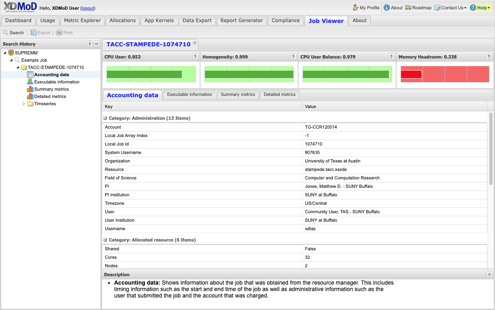
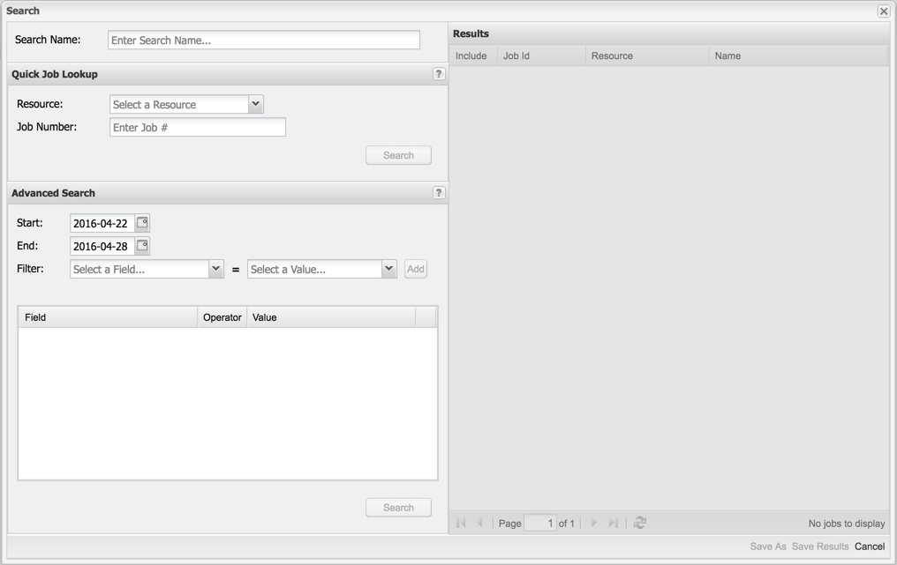
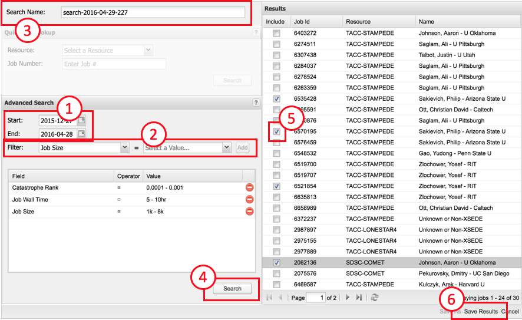
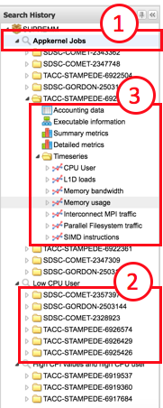
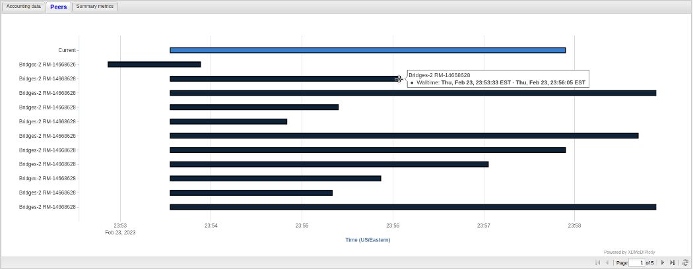
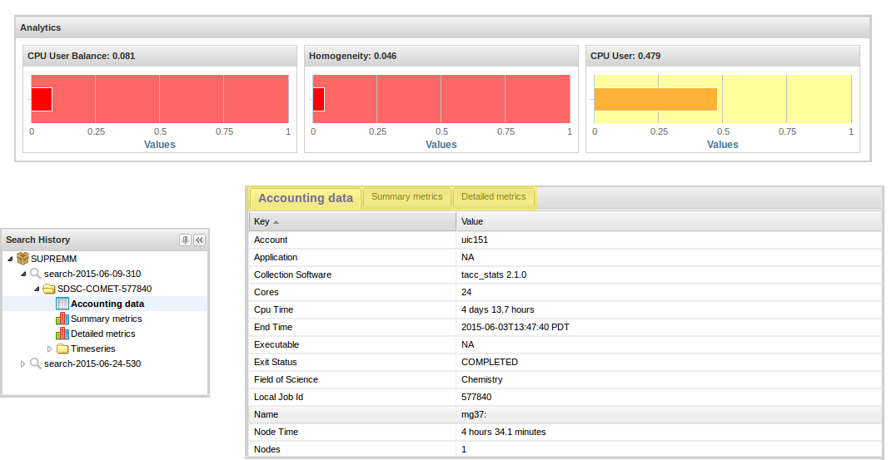
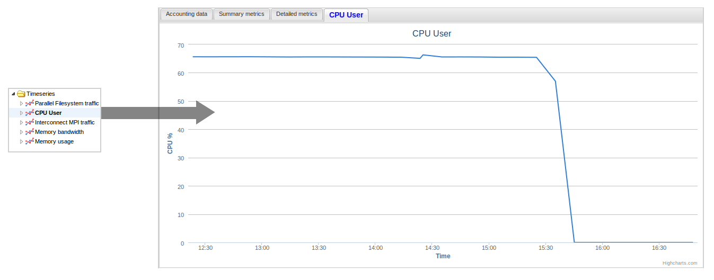

.. _job_viewer:

Job Viewer
=============

The Job Viewer Tab displays information about individual HPC jobs and
includes a search interface that allows jobs to be selected based on a
wide range of filters. An example of the job viewer tab is shown in
:numref:`job_viewer_tab`. The main components of the job viewer are the search
history pane and the main viewer pane. The search history pane uses a
tree menu that shows all saved searches as nodes in the tree. The jobs
that were selected in each search are listed under their respective
search node. The main viewer pane has a tabbed user interface that shows
the information for a selected job with one job per tab. The different
types of information within a job are shown in sub-tabs.

Note that the information available for a given job depends on the data
collection software being collected.

   Job Viewer Tab

Searching for jobs
-----------------------

There are two ways to search for jobs. If the job id is known, the quick
job lookup function can be used to locate the detailed data for the job.
Alternatively, the Advanced search function can be used to find jobs
based on one or more search parameters.

To activate the Job Viewer click on the Job Viewer tab, then on the
Search button in the upper left corner. This will bring up the
**Search** window (shown in :numref:`job_viewer_search_window`). The search window has
three main components, the **Quick Job Lookup** form, the **Advanced
Search** form and the **Results** panel. Use the Quick Job Lookup form
to find a known job based on its job id (i.e. the identifier that the
job was assigned by the job scheduler). First choose the Resource on
which the job ran from the drop-down list. Next enter the desired job
number in the Job Number box. Finally click on the Search button in the
lower right corner of the form. If there is information for this job in
XDMoD then a record will show in the results pane. You may optionally
choose a descriptive name for the job search in the Search Name entry
box and then click Save Results to add the job to the search history for
viewing.

   Search Window

Alternatively, if you are looking for jobs that satisfy a general set of
criteria, you can use the **Advanced Search** form (see :numref:`job_viewer_advanced_search`).
You must specify (1) the time frame for the search as well as
(2) one or more **Filters**. The filter field is selected from the drop
down list, the value for this field is then selected from the box to its
right and then click on the Add button to add the filter to the search.
Multiple filters can be added to the search and the same filter field
may be added multiple times with different values. You can optionally
enter a descriptive name for the search in the Search Name entry box
(3).

After the inputs have been completed, click on Search (4). If there are
any jobs that fit the given search criteria, a list of jobs will be
displayed. You can select specific jobs that you would like to view by
checking the box next to the job ID, (5) then click **Save Results** (6)
to add the selected jobs to the search history for viewing.

   Using the Advanced Search Form in the Search dialog.

Viewing job data
---------------------

Job information may only be viewed for jobs that are in the search
history. The search history tree on the left hand side of the interface
shows the saved searches. An annotated example of a search history tree
is shown in :numref:`job_viewer_search_history_tree`. The tree shows all saved searches, all
selected jobs for each search and the list of data available for each
job. Selecting a data node for a job will result in the job data loading
in the main viewer pane.

   Job viewer search history tree. The tree shows every
   saved search (1), all selected jobs for a search (2) and the data
   available for each job (3)

The different types of data available for a job are listed below:

-  At-a-glance analytics

-  Accounting data

-  Job script

-  Executable information

-  Summary metrics

-  Detailed metrics

-  Timeseries plots

Note that not all data may be available for all jobs. Availability of
data depends on the collection software installed on the HPC resource as
well as the hardware capabilities on the compute nodes. The only
information that is guaranteed to be present is the Accounting data.

At-a-glance analytics
~~~~~~~~~~~~~~~~~~~~~~~~~~~~

The at-a-glance analytics are shown at the top of the job tab and are
automatically displayed if they are available (there is no data node
displayed in the search history for the at-a-glance analytics). There
are three plots that show a summary of the values of selected
performance metrics of the specific job. The metrics that are displayed
here are normalized with values near 1 (displayed in green) indicating a
good value and values near 0 (displayed in red) indicating a poor value
for the metric. We note that not all jobs should be expected to have
good values for all metrics. The default metrics that are displayed are
CPU User Balance, Homogeneity, Memory Headroom and CPU User (see
:numref:`job_viewer_information`).
CPU User Balance indicates how well balanced the usage is between
the various cores in the job based on the fraction of time each core
spends in CPU user mode. CPU User Balance is defined as

:math:`CPU\ User\ Balance\  = \ 1\  - \frac{CPU_{max\ } - \ CPU_{\min}}{CPU_{\max}}`

where :math:`CPU_{\max}` is the CPU usage for the core with the highest
average usage and :math:`CPU_{\min}` is the CPU usage for the core with
the lowest average usage. A value near 1 is ideal in that all cores are
working equally; a value near zero indicates that one or more cores are
nearly idle. Homogeneity is a measure of how uniform the L1D cache load
rate is over the lifetime of the job. The L1D load rate is a useful
metric measuring if the job is accomplishing useful data processing.
High values near 1 are good; if the value is low near 0, the job should
be investigated to determine if data processing terminated prematurely.
CPU User is the ratio of CPU clock ticks spent in the CPU user mode
summed over all of the cores divided by the total clock ticks for the
job for all of the cores. Values near 1 are ideal indicating that all
cores are spending most of their time in CPU user mode. Values near 0
indicate a job where the cores are spending only a small fraction of
their time in CPU user mode.

Accounting data
~~~~~~~~~~~~~~~~~~~~~~

This tab shows the information about individual jobs obtained from the
:only:`<XSEDE>ACCESS allocation service` :only:`<Open> resource manager`.
This includes timing information such as the start and end time of the job
as well as administrative information such as the user that submitted the
job and the account that was charged.

Job script
~~~~~~~~~~~~~~~~~

This tab shows the job batch script that was passed to the resource
manager when the job was submitted. The script is displayed verbatim.

Executable information
~~~~~~~~~~~~~~~~~~~~~~~~~~~~~

This tab shows information about the processes that were run on the
compute nodes during the job. This information includes the names of the
various processes and may contain information about the linked
libraries, loaded modules and process environment.

Summary metrics
~~~~~~~~~~~~~~~~~~~~~~

This tab shows a table with the performance metrics collected during the
job. These are typically average values over the job. The label for each
row has a tooltip that describes the metric. The data are grouped into
the following categories:

-  CPU Statistics: information about the cores on which the job was
      assigned, such as CPU usage, FLOPs, CPI

-  File I/O Statistics: information about the data read from and written
      to block devices and file system mount points.

-  Memory Statistics: information about the memory usage on the nodes on
      which the job ran.

-  Network I/O Statistics: information about the data transmitted and
      received over the network devices.

Detailed metrics
~~~~~~~~~~~~~~~~~~~~~~~

This tab shows the data generated by the job summarization software.
Unlike the summary metrics listed above, this data is not normalized and
the format and content is specific to the job summarization software
used. Please consult the relevant job summarization software
documentation for details about these metrics.

Peers
~~~~~~~~

This tab shows a Gantt chart representation of all other HPC jobs that ran
concurrently using the same shared hardware resources. The peers tab has the
ability to drill down on the jobs that run concurrently by clicking on a
peer’s data. Note: For jobs with many peers, it is recommended to hover over
the start or end of a job due to tooltip displacement (see :numref:`peer_charts`).

   Peer Charts

Timeseries plots
~~~~~~~~~~~~~~~~~~~~~~~

The final aspect of the Job Viewer tab is the ability to view timeseries
plots of several different metrics. The available plots for a job are
listed under the Timeseries tree node in the search history (see
:numref:`job_viewer_search_history_tree`). The metrics that are available depend on the
collection software that runs on the compute nodes as well as the
hardware on the nodes themselves. A brief description of the metrics
follow:

-  CPU User: The ratio of time spent in user mode to total CPU time for
      the cores that were assigned to the job.

-  L1D loads: The ratio of L1D cache loads to reference CPU clock ticks
      for the cores that were assigned to the job.

-  Memory bandwidth: The rate of data transferred to DRAM.

-  Memory Usage: The memory usage reported by the OS for the nodes that
      were assigned to the job.

-  Interconnect MPI traffic: The rate of data transferred over the
      high-speed interconnect

-  Parallel filesystem traffic: The rate of data read from and written
      to the parallel filesystem

-  SIMD instructions: The rate of SIMD instructions (this is correlated
      to the number of floating point operations).

-  Process memory: The amount of memory used by the processes that were
      run by the job

-  NFS Filesystem traffic: The rate of data read from and written to NFS
      mounted filesystems.

It is possible to drill down on the timeseries data by clicking on the
data series on the chart or by using the search history tree. The degree
to which it is possible to drill-down varies according to the metric.
For example, the CPU metric shows the compute node-level average values
and it is possible to drill down to the per-core values. The memory
metric shows the compute node-level average value and it is possible to
drill down to the individual NUMA nodes (for supported collection
software).

   Job Viewer Information

   Chart vs Time
