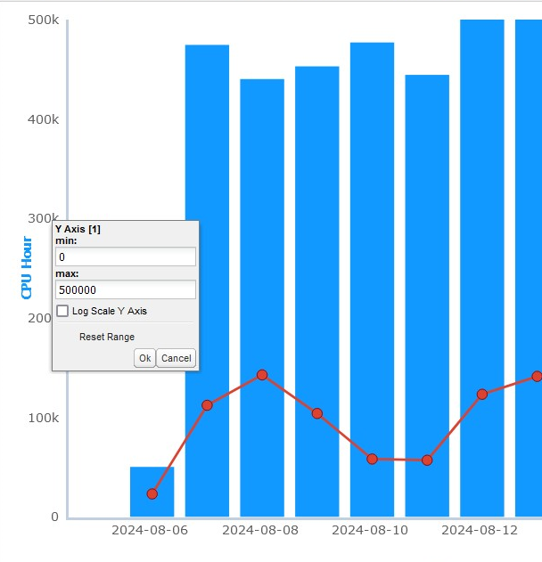
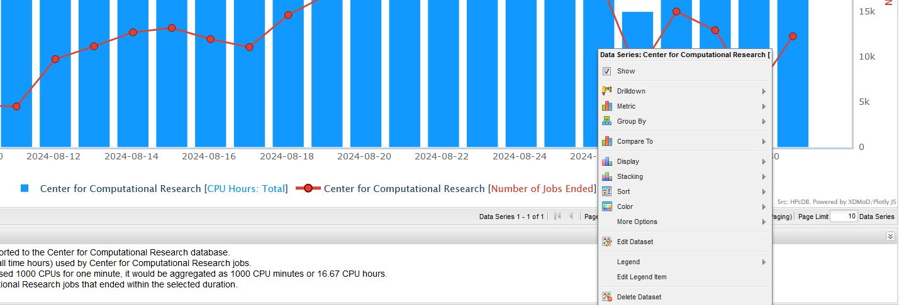

.. _metric_explorer:

Metric Explorer
==================

The Metric Explorer allows you to create complex plots containing
multiple metrics. It has many point-and-click features so you can easily
add and filter plotted data and customize plot appearance.

   Metric Explorer

The **Quick Filter** drop-down menu in the top toolbar allows you to
rapidly focus the information source used by the Metric Explorer. Based
on the quick filter selected, the values that are displayed will vary.
For example, if you are a PI, selecting the PI quick filter provides
access to the information from all of your students’ jobs; however, if
you select User, you see only the information from jobs that you
submitted yourself.

Other features of the top toolbar include:

**Duration Selectors**: The :ref:`duration_selection_toolbar`
is provided for selection of the desired time frame. To define a custom
timeframe, specify a start and end date in the date fields to the right
of the **Duration** drop-down menu.

**Export Menu**: Allows you to download the currently visible chart in
graphical or datasheet form, and in various formats.

**Print**: Prepares a version of the chart for printing, and
automatically presents you with a print dialog.

**Available For Report**: when checked, the exact chart will be included
in the report generator’s list of available charts.

For more information about the top toolbar, refer to the
:ref:`common_user_interface_elements` section in this document.

The **Chart Options** region above your chart gives you ultimate
flexibility in the amount and type of statistics you want to view at any
time. The **Chart Options** region comprises five sections: Charts,
Data, Global Filters, and Options. Any changes you make in each section
will be immediately reflected in the chart.

The **Chart Viewer** is the area where the chart is generated by using
the chart settings. The chart viewer also uses a paged view. When not
all of the data series fit on one chart, multiple charts will be
generated. Buttons are provided above the chart for navigation through
the charts, when needed. The maximum number of data series in the chart,
or page size, can be configured in the chart limit input box above the
chart.

The sections that follow discuss the **Chart Options** region in more
detail.

Managing Charts
--------------------

.. table::
   :widths: 50 50

   +-----------------------------------+-----------------------------------------+
   | .. figure:: media/image32.png     | The **Charts** section                  |
   |    :name: metric_charts_section   | (:numref:`metric_charts_section` a)     |
   |                                   | allows you to manage chart              |
   |                                   | presets. Chart presets are mappings     |
   |    Charts Section                 | between all the components involved in  |
   |                                   | the chart (e.g. data series, filters,   |
   |                                   | etc.) and the textual identifier you    |
   |                                   | assign to each query.                   |
   |                                   |                                         |
   |                                   | Once you click on |image25| to create   |
   |                                   | a new chart, you will be presented with |
   |                                   | the dialog reference in                 |
   |                                   | :numref:`metric_charts_section` b.      |
   |                                   | Here, you have the opportunity          |
   |                                   | to name your chart for easy reference.  |
   |                                   |                                         |
   |                                   | Similarly, you can click on |image26|   |
   |                                   | to remove a selected chart preset.      |
   |                                   |                                         |
   |                                   | In earlier versions of XDMoD, charts    |
   |                                   | were automatically saved. However, the  |
   |                                   | current version gives you more control  |
   |                                   | over your charts. You must manually     |
   |                                   | save your charts by clicking on either  |
   |                                   | the Save or the Save As button, see     |
   |                                   | :numref:`metric_charts_section` a.      |
   |                                   | Charts or changes to                    |
   |                                   | charts that you do not explicitly save  |
   |                                   | will be lost when you exit XDMoD. An    |
   |                                   | Undo button allows you to cancel the    |
   |                                   | last change, and a Redo button lets you |
   |                                   | cancel the effect of the last Undo.     |
   |                                   |                                         |
   |                                   | To access your saved charts, simply     |
   |                                   | select the preset from the Load Chart   |
   |                                   | list (**Figure 9-2c**). If you have     |
   |                                   | lots of charts, you can utilize the     |
   |                                   | Search field located in the top left of |
   |                                   | the Load Chart area to target specific  |
   |                                   | charts.                                 |
   +-----------------------------------+-----------------------------------------+

.. |image26| image:: media/image109.png
   :width: 0.20833in
   :height: 0.20833in

.. alternative way of doing tables, but pandoc created the other type of table, and I wanted
   to be consistent

.. list-table
   :widths: 50 50

   * - .. figure:: media/image32.png
          :name: chart_tools

          Charts Tools
     - The **Charts** section (:numref:`chart_tools` a) allows you to manage chart
       presets. Chart presets are mappings between all the components involved in
       the chart (e.g. data series, filters, etc.) and the textual identifier you
       assign to each query.

       Once you click on\ |image25| to create a new chart, you will be presented with
       the dialog reference in **Figure 9-2b**. Here, you have the opportunity
       to name your chart for easy reference.

       Similarly, you can click on\ |image26| to remove a selected chart preset.

       In earlier versions of XDMoD, charts were automatically saved. However, the
       current version gives you more control over your charts. You must manually
       save your charts by clicking on either the Save or the Save As button, see
       **Figure 9-2a**. Charts or changes to charts that you do not explicitly save
       will be lost when you exit XDMoD. An Undo button allows you to cancel the
       last change, and a Redo button lets you cancel the effect of the last Undo.

       To access your saved charts, simply select the preset from the Load Chart
       list (**Figure 9-2c**). If you have lots of charts, you can utilize the
       Search field located in the top left of the Load Chart area to target specific charts.

.. _basic_chart_options:

Basic Chart Options
------------------------

.. table::
   :widths: 50 50

   +-----------------------------------+----------------------------------+
   | .. figure:: media/image92.png     | The **Basic Chart Options**      |
   |    :name: metric_chart_options    | button can be found at the top   |
   |                                   | right of the chart viewer        |
   |    Chart Options                  | (:numref:`metric_explorer_tab`). |
   |                                   | It allows you                    |
   |                                   | to customize general chart       |
   |                                   | settings, see **Figure 9-3**.    |
   |                                   |                                  |
   |                                   | -  The *Dataset Type* parameter  |
   |                                   |    gives you the ability to      |
   |                                   |    customize the view of the     |
   |                                   |    data on the chart. By         |
   |                                   |    selecting Aggregate, the      |
   |                                   |    chart will display a          |
   |                                   |    collection of data series,    |
   |                                   |    each grouped by whichever     |
   |                                   |    category you decide (as       |
   |                                   |    managed in the **Data**       |
   |                                   |    section). By selecting        |
   |                                   |    Timeseries, the chart will    |
   |                                   |    show data over time.          |
   |                                   |    Additionally, you can set a   |
   |                                   |    title for the chart.          |
   |                                   |                                  |
   |                                   | -  You are also able to          |
   |                                   |    fine-tune the appearance of   |
   |                                   |    the chart. You can adjust the |
   |                                   |    location of the legend. In    |
   |                                   |    addition, you are able to set |
   |                                   |    the **Font Size** for all     |
   |                                   |    textual elements of the chart |
   |                                   |    (e.g. axis labels, axis       |
   |                                   |    values, legend labels, chart  |
   |                                   |    title, etc.)                  |
   |                                   |                                  |
   |                                   | -  If you wish to feature your   |
   |                                   |    chart on the Summary tab (or  |
   |                                   |    Dashboard tab) (for           |
   |                                   |    convenience purposes), check  |
   |                                   |    the **Show in the Summary     |
   |                                   |    tab** checkbox.               |
   +-----------------------------------+----------------------------------+

In the present version of the Metric Explorer, you can easily change
plots by simply clicking on the data series in the chart. A dialog box
opens (:numref:`metric_explorer_plot_rename`) allowing a wide range of
changes, including adding another metric, drilling downs, and options
that alter the display format.

   In the Metric Explorer Plots can easily be changed directly by clicking on them.

Additional Chart Features
-------------------------
Clicking on a y-axis label will open a dialog box next to the clicked label.
Through this dialog box you can adjust the minimum and maximum values of the
range for any of the y-axes on the plot. You can reset these values by
clicking on the "Reset Range" button or by erasing the values. Additionally,
you can enable a logarithmic scale for that y-axis.

   You can adjust the range and enable a log scale by clicking on a
   y-axis label.

Clicking on an x-axis label will open a dialog box next to the clicked label.
Through this dialog box you can adjust the time duration for the chart.
The options available replicate the duration toolbar.

   You can adjust the time duration by clicking on an x-axis label.

Clicking on a legend entry will open a dialog box next to the clicked entry.
The context menu provided through the legend entry is the same as clicking on
a point in the plot. The only option that is excluded is the "Show Raw Data" option.

   You can interact with a data series context menu by clicking on its
   respective legend entry.

For Metric Explorer charts, the zoom level of the plot is reset differently
than the other tabs. The zoom level can be reset by clicking on the chart
and choosing the "Reset Zoom" option from the context menu.

.. figure:: media/metric_explorer_reset_zoom.png
   :name: metric_explorer_reset_zoom

   You can reset the zoom level of a chart by clicking on it and
   choosing "Reset Zoom."

Managing Data Series
-------------------------

   Adding additional data to a chart is made easier
   through the menu on the left-hand-side. Here we show how to add CPU
   Hours Per Job to an existing plot of NUs charged Per job and Number
   of jobs Ended (Selecting CPU Hours Per Job is shown in the upper left
   corner of the window).

   Adding data to the plot is as simple as clicking on the chart.

Adding another data series to a chart can be accomplished in several
ways. :numref:`metric_explorer_left_panel_add_data` shows that clicking on a metric in the chart tree
brings up a dialog box. This dialog allows you to choose what data will
be displayed and how it will be grouped. In addition, clicking in the
chart view area will bring up a chart options box (:numref:`metric_explorer_click_add_data`) that
allows you to choose to add a new metric. Clicking on a particular data
series also brings up a dialog box that has an option to select a new
metric.

An alternative way to introduce data into a chart is to click on the
*Add Data* button as highlighted in :numref:`metric_explorer_data_series_workflow`. Doing so will
present you with a collection of categories referred to as *realms*.
Click on a realm to reveal all the respective metrics. In :numref:`metric_explorer_data_series_workflow`
the allocations realm has been selected showing 6 possible metrics.
Clicking on the XD SU’s Allocated metric brings up the Data Series
Definition dialog box. The Data Series Definition dialog box allows you
to control how the metric is to be represented and displayed on the
chart. In addition, filters can be applied to the data series for even
more precision. For example, you may be interested in the number of jobs
run by a particular user at an institution for a particular time frame.
Using filters allows you to acquire this information.

.. figure:: media/image11.png
   :name: metric_explorer_data_series_workflow

   Data Series workflow of Metric Explorer

In addition to adding new metrics to a plot, the Metric Explorer also
allows the user to drill down for more detailed information on a
particular metric. :numref:`metric_explorer_dialogue_box` shows the dialog box that opens
when you click on a data series within the chart viewer. Selecting
“Drilldown” will display the data analyzed by the chosen dimension or
grouping, as described by Section 5.3 (the Chart Viewer) previously.

   Changing how the data for a given data series is
   displayed can now be achieved simply by clicking on the data series
   to bring up a dialogue box.

   Data section of Metric Explorer

The **Data** section of the Metric Explorer allows you to include one
or many metrics on a single chart. As illustrated in :numref:`metric_explorer_data_options`,
you are given many options which allow you to customize the look of
each data series. By double-clicking on a data entry in the grid
below, you will be presented with a dialog which gives you finer
control of how the data can be represented.

Managing Filters
---------------------

.. table::
   :widths: 75 25

   +----------------------------------------------+---------------------------------------+
   | .. figure:: media/image38.png                | As mentioned in the previous section, |
   |    :name: metric_explorer_filters            | filters allow you to focus on a       |
   |                                              | subset of the data. To apply filters  |
   |    Filters section of Metric Explorer        | to your data, you can either consult  |
   |                                              | the *Local Filters* section of the    |
   |                                              | *Data Series Definition* dialog (see  |
   |                                              | :numref:`metric_explorer_filters`),   |
   |                                              | or make use of *Global Filters* (see  |
   |                                              | :numref:`metric_filter_logic`).       |
   |                                              |                                       |
   |                                              | *Local* Filters are solely tailored   |
   |                                              | to a single data series, whereas      |
   |                                              | *Global* Filters are applied to all   |
   |                                              | the data series you have introduced   |
   |                                              | into the **Data** section of the      |
   |                                              | Metric Explorer.                      |
   |                                              |                                       |
   |                                              | To create a filter, click on the *Add |
   |                                              | Filter* button (as highlighted in     |
   |                                              | :numref:`metric_filter_logic`). Doing |
   |                                              | so will provide you with a list of    |
   |                                              | dimensions (or parameters) you can    |
   |                                              | filter with. Once you have selected a |
   |                                              | dimension, you will be presented with |
   |                                              | a dialog allowing you to navigate,    |
   |                                              | search, and select parameter values.  |
   |                                              | Click on OK to apply any selected     |
   |                                              | filters.                              |
   +----------------------------------------------+---------------------------------------+

.. table::
   :widths: 75 25

   +---------------------------------------------------+--------------------------------+
   | .. figure:: media/image105.png                    | Filters in the                 |
   |    :name: metric_filter_logic                     | Metric Explorer                |
   |                                                   | are applied as                 |
   |    Understanding filter logic                     | follows:                       |
   |                                                   | Dimensions are                 |
   |                                                   | logically                      |
   |                                                   | **and**-ed                     |
   |                                                   | together, and                  |
   |                                                   | values                         |
   |                                                   | associated with                |
   |                                                   | the same                       |
   |                                                   | dimension are                  |
   |                                                   | logically                      |
   |                                                   | **or**-ed                      |
   |                                                   | together.                      |
   |                                                   |                                |
   |                                                   | An example of                  |
   |                                                   | filter logic is                |
   |                                                   | illustrated in                 |
   |                                                   | :numref:`metric_filter_logic`. |
   +---------------------------------------------------+--------------------------------+
