.. _report_generator:

Report Generator
===================

To manage reports, click on the **Report Generator** tab.

The default view of the Report Generator UI is shown below. The left
region provides a listing of any reports you have created. The right
region displays any charts you have chosen to make available for
building a report (see :ref:`common_available_report`
section).

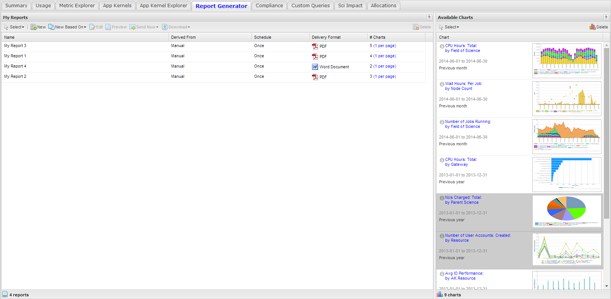

Each report entry present under the **Report Generator** tab displays
the title of the chart, whether it was generated manually or from a
template, the delivery schedule, the delivery format and the number of
charts. In the Available charts section each chart has its title, the
timeframe of interest, and a thumbnail view. The time frame defaults to
the one chosen prior to making the chart available for reporting.

If you create a chart by a process that includes at least one filtering
step and choose to make that chart available for reporting, information
on the filtering and drilldown processes can be viewed in by moving your
mouse over the information icon to the left the chart title in the chart
entry as shown in :numref:`report_generator_chart_details`.

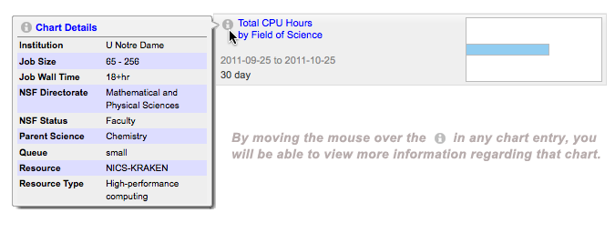

   Viewing additional details for a chart entry

The top toolbar serves as the starting point for managing a report.

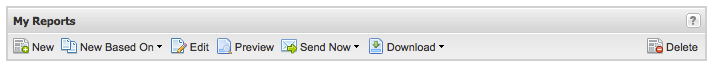

   Report Generator toolbar

**New**: Creates a new report. A default (and unique) name will be
chosen, and no charts will be included.

**New Based On**: Creates a new report which contains all the charts and
settings of an existing report. A default (and unique) name will be
chosen and assigned to this report.

**Edit**: Opens an existing report for editing.

*NOTE: Another way to open a report for editing is to double-click on
one of the entries in* **My Reports**\ *:*

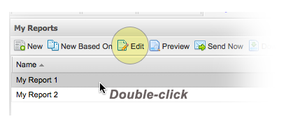

   Editing a report

-  **Preview**: Previews the (selected) report prior to sending it.

-  **Send Now**: Builds and sends the (selected) report to the email
   address associated with the user.

-  **Download**: Builds the (selected) report and presents it to the
   user as a downloadable file.

.. _selection_model:

Selection Model
--------------------

All the lists / grids under the **Report Generator** tab have been
designed such that multiple selections can be made for more efficient
workflows.

Clicking on one entry, followed by holding **shift** while clicking
another entry results in the selection of both entries along with all
the entries that fall in between them:

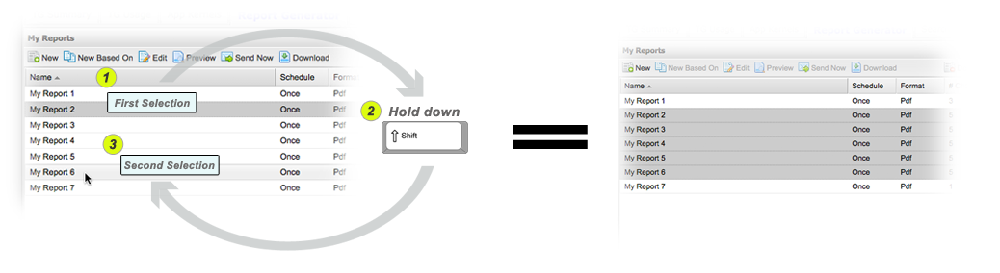

   Selecting charts for addition in a report

Clicking on one entry, followed by holding the control key (or
**command** key on a Mac) while clicking another entry results in
individual selections being added (appended) to what is currently
selected.

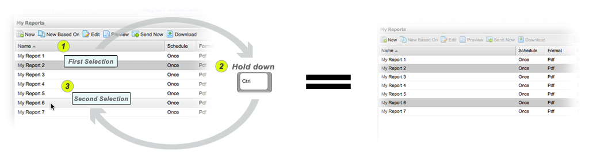

   Another method to select charts for addition in a report

**Note**: *Deselections can be made by clicking on selected items in the
grids while holding down the* **control** *key (or* **command** *key on
a Mac).*

Whether you choose to create a new report or edit an existing report,
you will be directed to the **Report Editor**:

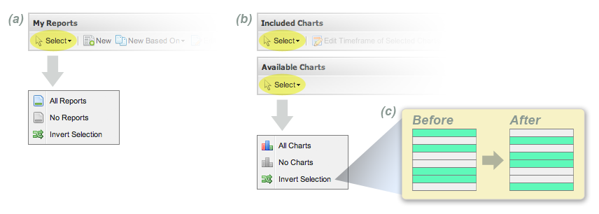

   Selecting reports and charts via the Select menus

An alternative way to select reports and charts in the Report Generator
is to make use of the **Select** menus (as highlighted in :numref:`report_generator_select_2` a and
:numref:`report_generator_select_2` b). Using these select menus is especially helpful
if you are dealing with a substantial number of reports or charts. The
select menus also gives you the ability to invert selections made in the
report and chart grids. In other words, when you click on Invert
Selection, any items previously selected will become deselected, and
vice-versa (see :numref:`report_generator_select_2` c).

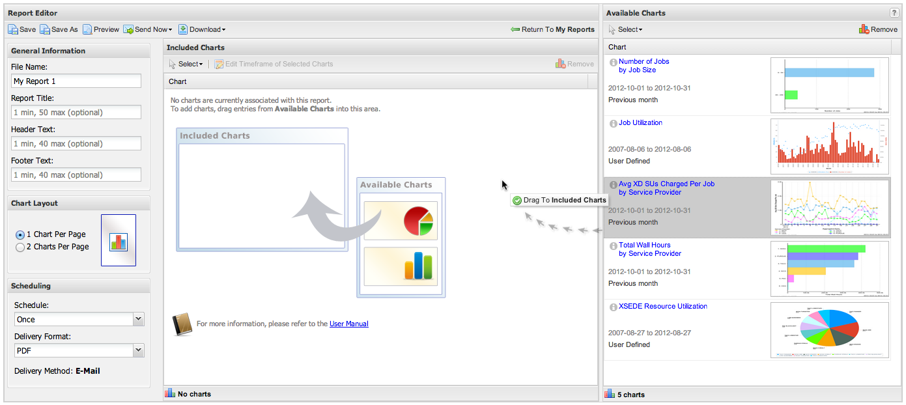

   Report editor

.. table::
   :widths: 40 60

   +-----------------------------------+-----------------------------------------+
   | .. figure:: media/image98.png     | **General Information** for this report |
   |    :name: report_info             | is displayed on the left side of the    |
   |                                   | Report Editor. The only required field  |
   |    Information to be entered to   | is the report File Name, which must be  |
   |    customize a report             | unique. When creating a new report      |
   |                                   | (including a new report based on        |
   |                                   | another report), a default unique file  |
   |                                   | name will be generated and assigned to  |
   |                                   | the **File Name** field. |br| |br|      |
   |                                   |                                         |
   |                                   | The **Chart Layout** section allows you |
   |                                   | to control how many charts are to       |
   |                                   | appear on a single page. |br| |br|      |
   |                                   |                                         |
   |                                   | The **Scheduling** section allows you   |
   |                                   | to customize the frequency in which     |
   |                                   | reports are to be sent to your email    |
   |                                   | address (associated with your account). |
   |                                   | Schedule options include Daily, Weekly, |
   |                                   | Monthly, Quarterly, Semi-annually, and  |
   |                                   | Annually. To disable automatic delivery |
   |                                   | of reports, set the Schedule option to  |
   |                                   | Once.                                   |
   |                                   |                                         |
   |                                   | Currently available formats for reports |
   |                                   | are PDF and Word Document.              |
   +-----------------------------------+-----------------------------------------+

To add charts to a report, simply drag an entry from the list of
**Available Charts** (on the right-hand side) into the **Included
Charts** list. See the section entitled :ref:`selection_model`
for adding multiple charts at once.

The order in which the charts appear in the **Included Charts** section
of the Report Editor dictates the order in which they will appear in the
report. Re-ordering of charts in the report can be accomplished by
simply dragging the charts into the desired order:

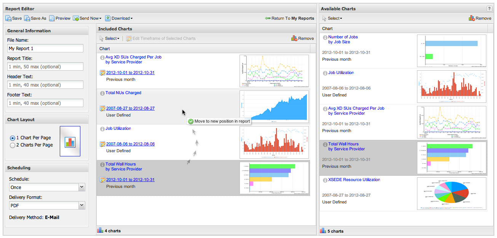

   Reordering charts in a report

Changing Chart Timeframes
------------------------------

Should you decide (during the report building process) that you want to
change the timeframe of a given chart, you can easily accomplish this
task by either clicking on the timeframe or the edit icon |image43| to
the left of the time frame in the respective chart entry. As a result,
you will be presented with a dialog for conveniently updating the
timeframe to your liking.

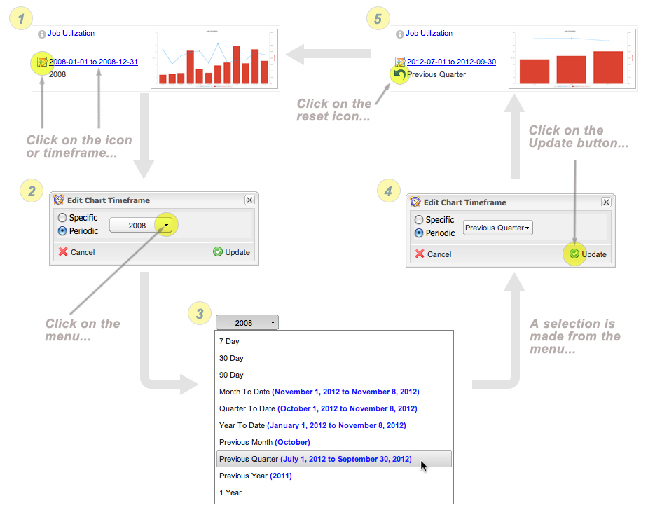

   Changing the timeframe of a chart entry in the report editor

**Note:** If you want to edit timeframes for multiple charts in a
report, select two or more charts, then click on the Edit Timeframe of
Selected Charts button in the top menu. Doing so will bring up the same
Edit Chart Timeframe dialog as mentioned above. When you click on
Update, each of the charts you had previously selected will update to
reflect the new timeframe you specified.

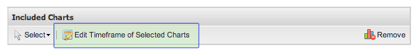

Previewing a Report
------------------------

At any time during the report editing process, you may preview the
current state of the report by first saving and then pressing the
**Preview** button (previewing reports is also possible from the **My
Reports** view):

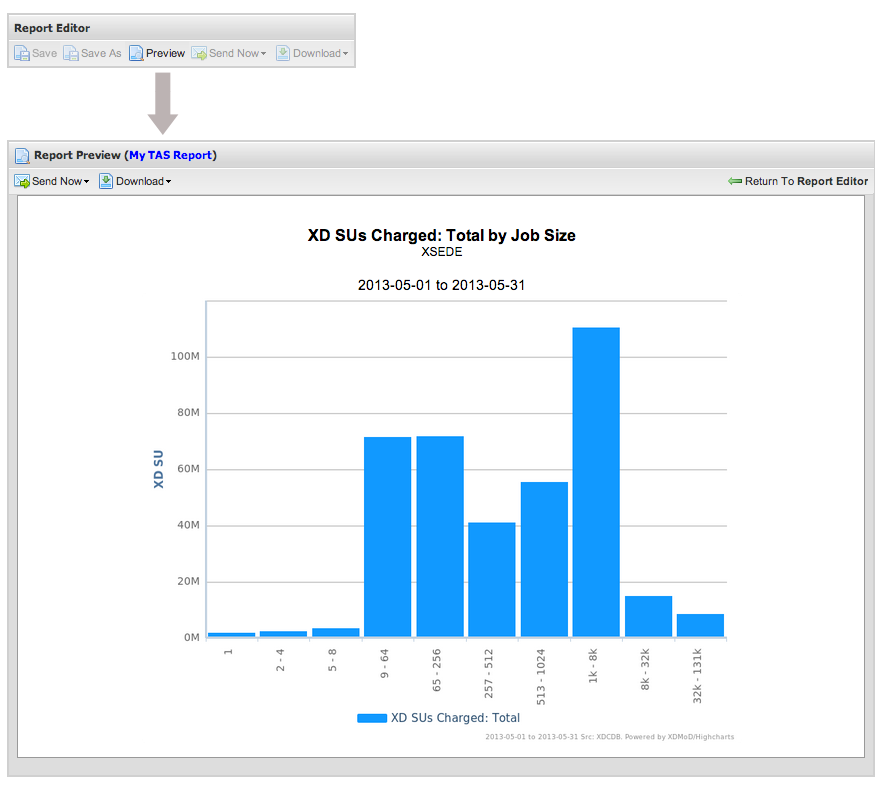

   Previewing a report

Building, Exporting Reports
--------------------------------

To build the report (as a PDF or MS Word document), you can make use of
the **Send Now** and **Download** options available from any of the
following sections: **My Reports**, **Report Editor**, and **Report
Preview**. The **Download** feature will allow you to immediately access
or download the resulting document, whereas the **Send Now** feature
will email the constructed report to the address associated with your
profile (see the :ref:`my_profile_button` section).

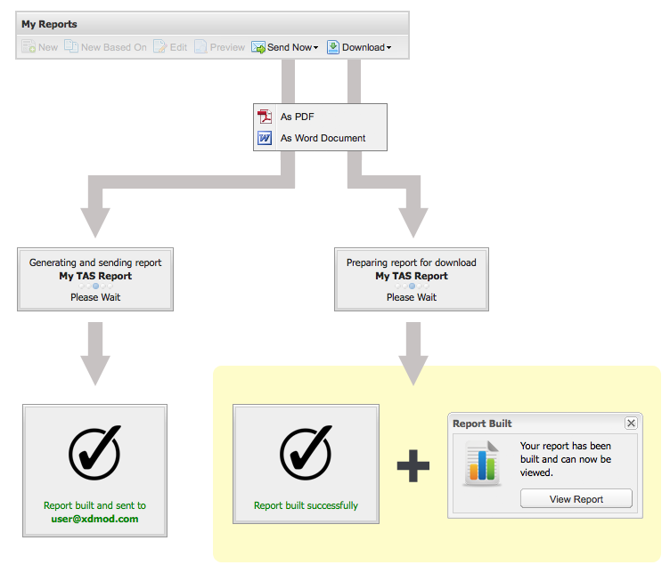

   Sending a report with Send Now or Download

Report Templates
---------------------

Report templates allow you to easily construct a set of reports,
complete with charts. This is particularly useful for System Providers,
for example, who want to acquire comprehensive information regarding
their resources without having to go through the time-consuming task of
navigating XDMoD and hand-selecting a series of charts.

.. table::
   :widths: 50 50

   +-----------------------------------------+----------------------------+
   | .. figure:: media/image27.png           | At this moment, report     |
   |    :name: report_creation               | template functionality is  |
   |                                         | only available to          |
   |    Creating reports from templates      | center-based roles (e.g.   |
   |                                         | Center Directors and       |
   |                                         | Center Staff members).     |
   |                                         |                            |
   |                                         | If no reports have been    |
   |                                         | selected, clicking on      |
   |                                         | **New Based On** will      |
   |                                         | simply present a menu of   |
   |                                         | the available templates    |
   |                                         | for you to use. If a       |
   |                                         | report has been selected   |
   |                                         | prior to this action, then |
   |                                         | that report will appear at |
   |                                         | the top of the list        |
   |                                         | followed by available      |
   |                                         | templates. This gives you  |
   |                                         | the option of either       |
   |                                         | cloning an existing report |
   |                                         | or deriving a new report   |
   |                                         | from a template.           |
   |                                         | :numref:`report_creation`  |
   |                                         | a illustrates this         |
   |                                         | logic.                     |
   |                                         |                            |
   |                                         | If your account is         |
   |                                         | associated with multiple   |
   |                                         | centers, you will be able  |
   |                                         | to select the center from  |
   |                                         | which to derive reports.   |
   |                                         | The template you select    |
   |                                         | will direct you to a       |
   |                                         | sub-menu consisting of the |
   |                                         | centers associated with    |
   |                                         | your XDMoD account. At     |
   |                                         | this point, simply select  |
   |                                         | the center you want to     |
   |                                         | generate reports for.      |
   |                                         | :numref:`report_creation`  |
   |                                         | b illustrates this.        |
   +-----------------------------------------+----------------------------+

If you were to select Template: **SP Quarterly Report**, for example,
XDMoD will automatically acquire the most informative charts per
resource belonging to the center of interest, and create a report for
each resource discovered. The Reports Overview window will automatically
refresh itself and present you with the reports derived from the
template.

Each generated report would be configured for quarterly delivery, and
each of the included charts would be based on the previous quarter.

.. |br| raw:: html

    
