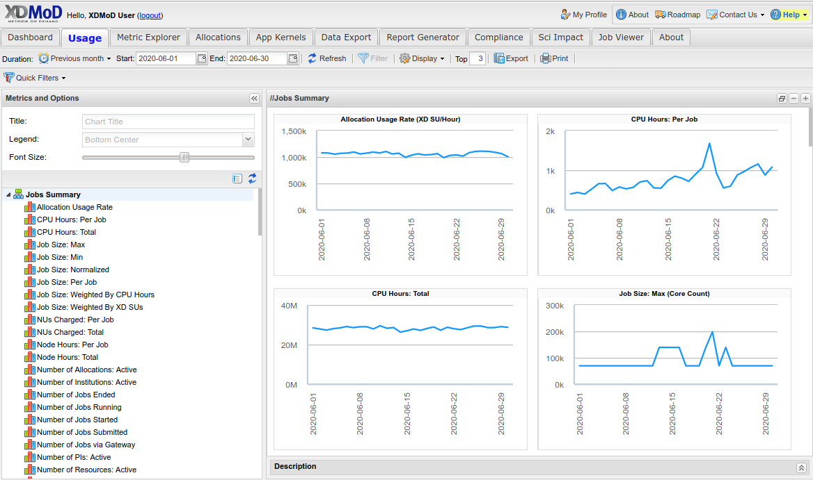
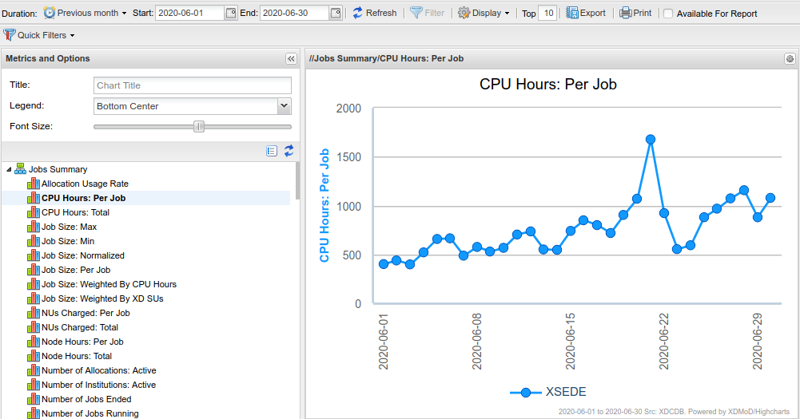
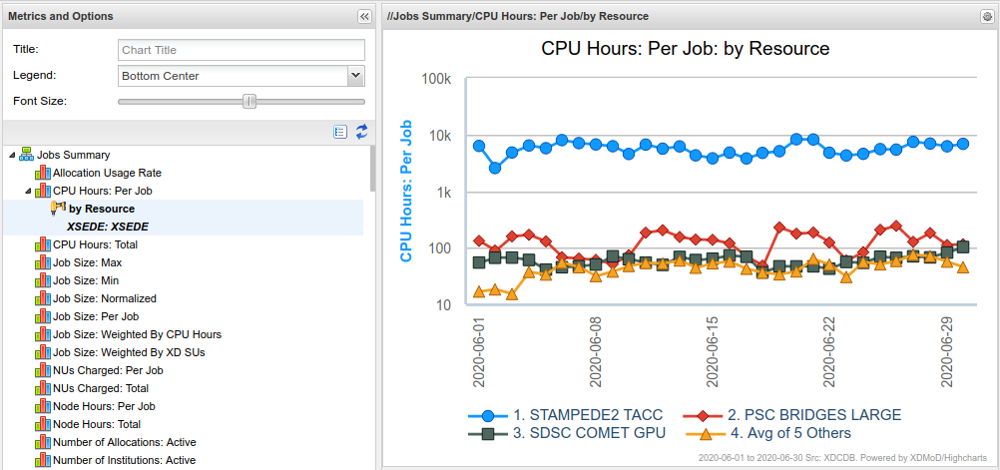

Usage Tab
============

   Usage Tab

The Usage tab (:numref:`usage_tab`) provides a convenient way to browse
XDMoD’s realms. It consists of a chart selection tree on the left, and a
chart viewer to the right of the page. You can interact with the chart
selection tree to explore the realms and view individual metric charts.

   Usage Tab Metric

To view a metric in the Usage tab (:numref:`usage_tab_metric`), expand the selection
tree and select an item. The CPU Hours Per Job metric from the Jobs
realm is shown. You can use the Duration and Chart Configuration
controls to customize the chart (Refer to section “Common User Interface
Elements”). For example, you can:

-  Change the data duration

-  Change the plot’s display

Note that any selection in the Duration control applies to all charts in
the Usage tab.

   Usage Tab Drilldown

You can drill down on a metric in the Usage tab (:numref:`usage_tab_drilldown`) by
left-clicking on the plotted data and selecting a dimension.
Drilldown of CPU Hours Per Job by Resource is shown. To further
customize the plot, you can use the configuration controls, or export
the plot to Metric Explorer by clicking the Gear icon at upper right
of the plot window.
